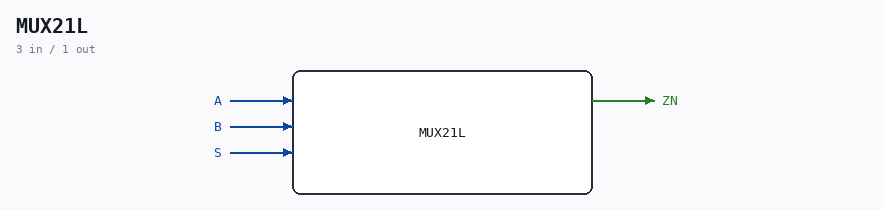

# MUX21L

Source: `/mnt/e/Dev/Repos/Ronny/nd-120/Verilog/Shared/ndlib/MUX21L.v`

> Generated by `Verilog/tests/module_doc.py` from the `//!`
> comments in the source. Do not edit by hand - edit the RTL comments and regenerate.

## Description

ND120 Shared
Component : MUX21L
Last reviewed: 11-NOV-2024
Ronny Hansen

## Ports

| Direction | Width | Name | Description |
|---|---|---|---|
| input | `1` | `A` |  |
| input | `1` | `B` |  |
| input | `1` | `S` |  |
| output | `1` | `ZN` |  |
