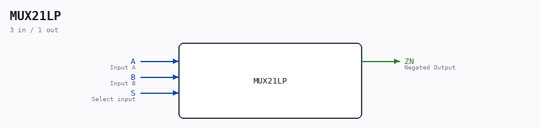

# MUX21LP

Source: `/mnt/e/Dev/Repos/Ronny/nd-120/Verilog/Shared/ndlib/MUX21LP.v`

> Generated by `Verilog/tests/module_doc.py` from the `//!`
> comments in the source. Do not edit by hand - edit the RTL comments and regenerate.

## Description

Component : MUX21LP  (2-to-1 Multiplexer NEGATED)

## Ports

| Direction | Width | Name | Description |
|---|---|---|---|
| input | `1` | `A` | Input A |
| input | `1` | `B` | Input B |
| input | `1` | `S` | Select input |
| output | `1` | `ZN` | Negated Output |
