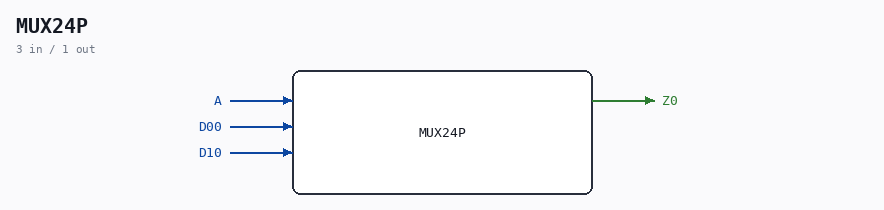

# MUX24P

Source: `/mnt/e/Dev/Repos/Ronny/nd-120/Verilog/Shared/ndlib/MUX24P.v`

> Generated by `Verilog/tests/module_doc.py` from the `//!`
> comments in the source. Do not edit by hand - edit the RTL comments and regenerate.

## Ports

| Direction | Width | Name | Description |
|---|---|---|---|
| input | `1` | `A` |  |
| input | `1` | `D00` |  |
| input | `1` | `D10` |  |
| output | `1` | `Z0` |  |
