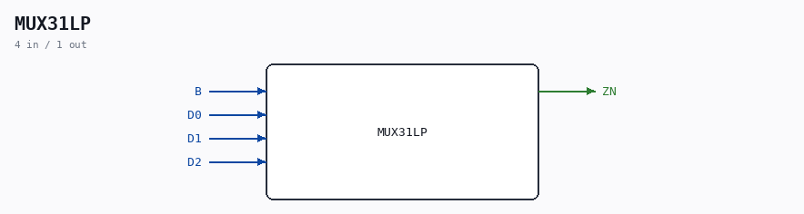

# MUX31LP

Source: `/mnt/e/Dev/Repos/Ronny/nd-120/Verilog/Shared/ndlib/MUX31LP.v`

> Generated by `Verilog/tests/module_doc.py` from the `//!`
> comments in the source. Do not edit by hand - edit the RTL comments and regenerate.

## Description

Component : MUX31LP
Manually cleaned up from logisim generator that creates wires not used..

## Ports

| Direction | Width | Name | Description |
|---|---|---|---|
| input | `1` | `B` |  |
| input | `1` | `D0` |  |
| input | `1` | `D1` |  |
| input | `1` | `D2` |  |
| output | `1` | `ZN` |  |
