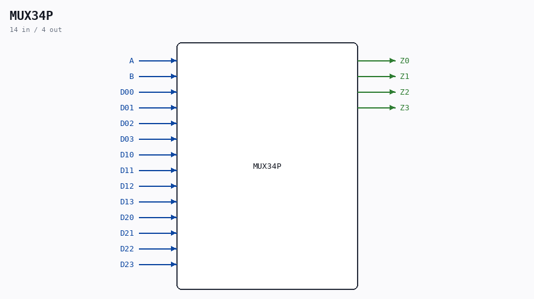

# MUX34P

Source: `/mnt/e/Dev/Repos/Ronny/nd-120/Verilog/Shared/ndlib/MUX34P.v`

> Generated by `Verilog/tests/module_doc.py` from the `//!`
> comments in the source. Do not edit by hand - edit the RTL comments and regenerate.

## Description

ND120 Shared
Component: MUX34P
Last reviewed: 2-FEB-2025
Ronny Hansen

## Ports

| Direction | Width | Name | Description |
|---|---|---|---|
| input | `1` | `A` |  |
| input | `1` | `B` |  |
| input | `1` | `D00` |  |
| input | `1` | `D01` |  |
| input | `1` | `D02` |  |
| input | `1` | `D03` |  |
| input | `1` | `D10` |  |
| input | `1` | `D11` |  |
| input | `1` | `D12` |  |
| input | `1` | `D13` |  |
| input | `1` | `D20` |  |
| input | `1` | `D21` |  |
| input | `1` | `D22` |  |
| input | `1` | `D23` |  |
| output | `1` | `Z0` |  |
| output | `1` | `Z1` |  |
| output | `1` | `Z2` |  |
| output | `1` | `Z3` |  |
