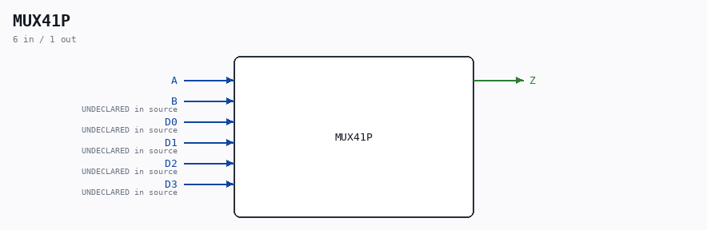

# MUX41P

Source: `/mnt/e/Dev/Repos/Ronny/nd-120/Verilog/Shared/ndlib/MUX41P.v`

> Generated by `Verilog/tests/module_doc.py` from the `//!`
> comments in the source. Do not edit by hand - edit the RTL comments and regenerate.

## Description

Component : MUX41P

## Ports

| Direction | Width | Name | Description |
|---|---|---|---|
| input | `1` | `A` |  |
| output | `1` | `Z` |  |
| input | `1` | `B` | UNDECLARED in source |
| input | `1` | `D0` | UNDECLARED in source |
| input | `1` | `D1` | UNDECLARED in source |
| input | `1` | `D2` | UNDECLARED in source |
| input | `1` | `D3` | UNDECLARED in source |
