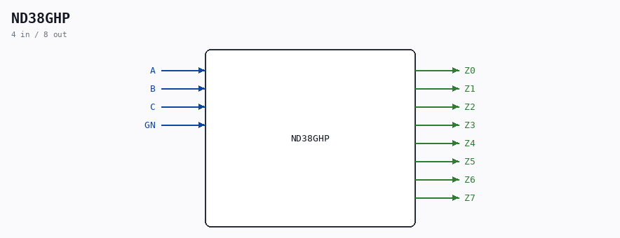

# ND38GHP

Source: `/mnt/e/Dev/Repos/Ronny/nd-120/Verilog/Shared/ndlib/ND38GHP.v`

> Generated by `Verilog/tests/module_doc.py` from the `//!`
> comments in the source. Do not edit by hand - edit the RTL comments and regenerate.

## Description

ND120
Component : ND38GHP  (3-to-8 decoder)
Last reviewed: 1-DEC-2024
Ronny Hansen

## Ports

| Direction | Width | Name | Description |
|---|---|---|---|
| input | `1` | `A` |  |
| input | `1` | `B` |  |
| input | `1` | `C` |  |
| input | `1` | `GN` |  |
| output | `1` | `Z0` |  |
| output | `1` | `Z1` |  |
| output | `1` | `Z2` |  |
| output | `1` | `Z3` |  |
| output | `1` | `Z4` |  |
| output | `1` | `Z5` |  |
| output | `1` | `Z6` |  |
| output | `1` | `Z7` |  |
