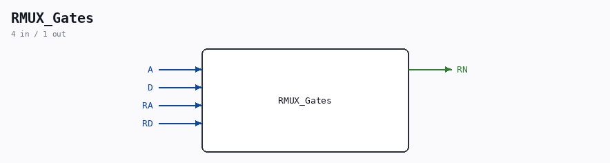

# RMUX_Gates

Source: `/mnt/e/Dev/Repos/Ronny/nd-120/Verilog/Shared/ndlib/RMUX_Gates.v`

> Generated by `Verilog/tests/module_doc.py` from the `//!`
> comments in the source. Do not edit by hand - edit the RTL comments and regenerate.

## Description

ND120 Shared
Component : RMUX_Gates
Last reviewed: 11-NOV-2024
Ronny Hansen

## Ports

| Direction | Width | Name | Description |
|---|---|---|---|
| input | `1` | `A` |  |
| input | `1` | `D` |  |
| input | `1` | `RA` |  |
| input | `1` | `RD` |  |
| output | `1` | `RN` |  |
