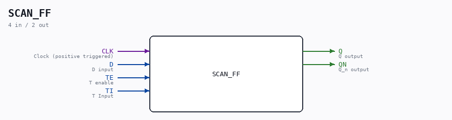

# SCAN_FF

Source: `/mnt/e/Dev/Repos/Ronny/nd-120/Verilog/Shared/ndlib/SCAN_FF.v`

> Generated by `Verilog/tests/module_doc.py` from the `//!`
> comments in the source. Do not edit by hand - edit the RTL comments and regenerate.

## Description

ND120 Shared
SCAN FLIP-FLOP (Also known as FDIS in the DELILAH schematics)
Positive edge triggered D flip-flop with scan
Its a D flip-flop with a 2-input multiplexer on the D input
When TE (T enable) input is negated,
the circuit behaves like an ordinary D flip-flop.
When TE is asserted,
it takes its data from TI (T input) instead of from D.
Last reviewed: 1-DEC-2024
Ronny Hansen

## Ports

| Direction | Width | Name | Description |
|---|---|---|---|
| input | `1` | `CLK` | Clock (positive triggered) |
| input | `1` | `D` | D input |
| input | `1` | `TE` | T enable |
| input | `1` | `TI` | T Input |
| output | `1` | `Q` | Q output |
| output | `1` | `QN` | Q_n output |
