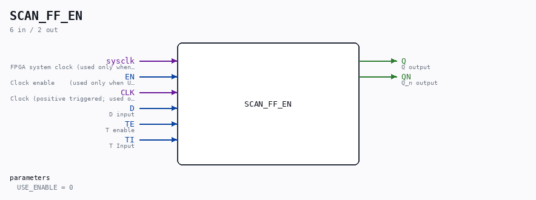

# SCAN_FF_EN

Source: `/mnt/e/Dev/Repos/Ronny/nd-120/Verilog/Shared/ndlib/SCAN_FF_EN.v`

> Generated by `Verilog/tests/module_doc.py` from the `//!`
> comments in the source. Do not edit by hand - edit the RTL comments and regenerate.

## Description

ND120 Shared
SCAN_FF_EN - SCAN_FF with an optional clock-enable mode.
USE_ENABLE=0 (default): wraps the original SCAN_FF - clocked on
posedge CLK, bit-for-bit the original behaviour (latch mode).
USE_ENABLE=1: clocked on posedge sysclk, captures when EN is high.
For the P2 clock-domain conversions (docs/
plan-fix-unconstrained-clocks.md): EN is a CYC_36 *_EN pulse
aligned so the capture lands on the same edge the phase-accurate
clock rises - the CLK pin is unused in this mode and the flop
lives in the sysclk domain (constrained, retimable, no fabric-
routed clock).
Last reviewed: 9-JUL-2026
Ronny Hansen

## Parameters

| Parameter | Default |
|---|---|
| `USE_ENABLE` | `0` |

## Ports

| Direction | Width | Name | Description |
|---|---|---|---|
| input | `1` | `sysclk` | FPGA system clock (used only when USE_ENABLE=1) |
| input | `1` | `EN` | Clock enable    (used only when USE_ENABLE=1) |
| input | `1` | `CLK` | Clock (positive triggered; used only when USE_ENABLE=0) |
| input | `1` | `D` | D input |
| input | `1` | `TE` | T enable |
| input | `1` | `TI` | T Input |
| output | `1` | `Q` | Q output |
| output | `1` | `QN` | Q_n output |
