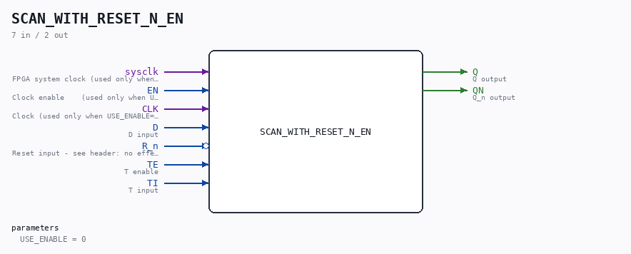

# SCAN_WITH_RESET_N_EN

Source: `/mnt/e/Dev/Repos/Ronny/nd-120/Verilog/Shared/ndlib/SCAN_WITH_RESET_N_EN.v`

> Generated by `Verilog/tests/module_doc.py` from the `//!`
> comments in the source. Do not edit by hand - edit the RTL comments and regenerate.

## Description

ND120 Shared
SCAN_WITH_RESET_N_EN - SCAN_WITH_RESET_N with an optional
clock-enable mode.
USE_ENABLE=0 (default): wraps the original SCAN_WITH_RESET_N -
posedge CLK, original behaviour.
USE_ENABLE=1: posedge sysclk, captures when EN is high (P2 clock-
domain conversion mode - see SCAN_FF_EN.v / the plan doc). The
CLK pin is unused in this mode.
IMPORTANT - R_n finding (verified 10-JUL-2026 against the current
sources):
The original wires MEMORY_4 as a plain D_FLIPFLOP with the
default ACTIVE_ASYNC=0, and D_FLIPFLOP's gen_sync branch IGNORES
its preset/reset pins entirely (always @(posedge clk) q <= d;).
So in the original module, R_n has NO EFFECT on the flop today.
(Additionally the .reset pin is wired to R_n directly - not
inverted - so even the intended polarity would be active-HIGH on
an *_n-named input; the sibling SCAN_WITH_SET_N inverts S_n.)
Mode 1 replicates the ACTUAL current behaviour exactly: R_n is
ignored (lint-waived) and q simply captures TE ? TI : D under EN.
Last reviewed: 10-JUL-2026
Ronny Hansen

## Parameters

| Parameter | Default |
|---|---|
| `USE_ENABLE` | `0` |

## Ports

| Direction | Width | Name | Description |
|---|---|---|---|
| input | `1` | `sysclk` | FPGA system clock (used only when USE_ENABLE=1) |
| input | `1` | `EN` | Clock enable    (used only when USE_ENABLE=1) |
| input | `1` | `CLK` | Clock (used only when USE_ENABLE=0) |
| input | `1` | `D` | D input |
| input | `1` | `R_n` *(active low)* | Reset input - see header: no effect in the original |
| input | `1` | `TE` | T enable |
| input | `1` | `TI` | T input |
| output | `1` | `Q` | Q output |
| output | `1` | `QN` | Q_n output |
