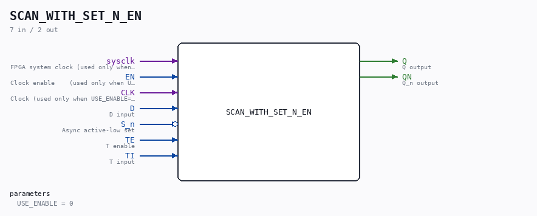

# SCAN_WITH_SET_N_EN

Source: `/mnt/e/Dev/Repos/Ronny/nd-120/Verilog/Shared/ndlib/SCAN_WITH_SET_N_EN.v`

> Generated by `Verilog/tests/module_doc.py` from the `//!`
> comments in the source. Do not edit by hand - edit the RTL comments and regenerate.

## Description

ND120 Shared
SCAN_WITH_SET_N_EN - SCAN_WITH_SET_N with an optional clock-enable
mode.
USE_ENABLE=0 (default): wraps the original SCAN_WITH_SET_N -
posedge CLK, original behaviour (async active-low set via S_n on
a D_FLIPFLOP with ACTIVE_ASYNC=1, d = TE ? TI : D).
USE_ENABLE=1: posedge sysclk, captures when EN is high (P2 clock-
domain conversion mode - see SCAN_FF_EN.v / the plan doc). The
CLK pin is unused in this mode. S_n stays an ASYNC active-low
set, exactly like the original's async preset (~S_n), and while
S_n is low it also overrides capture on the clock edge.
Last reviewed: 10-JUL-2026
Ronny Hansen

## Parameters

| Parameter | Default |
|---|---|
| `USE_ENABLE` | `0` |

## Ports

| Direction | Width | Name | Description |
|---|---|---|---|
| input | `1` | `sysclk` | FPGA system clock (used only when USE_ENABLE=1) |
| input | `1` | `EN` | Clock enable    (used only when USE_ENABLE=1) |
| input | `1` | `CLK` | Clock (used only when USE_ENABLE=0) |
| input | `1` | `D` | D input |
| input | `1` | `S_n` *(active low)* | Async active-low set |
| input | `1` | `TE` | T enable |
| input | `1` | `TI` | T input |
| output | `1` | `Q` | Q output |
| output | `1` | `QN` | Q_n output |
