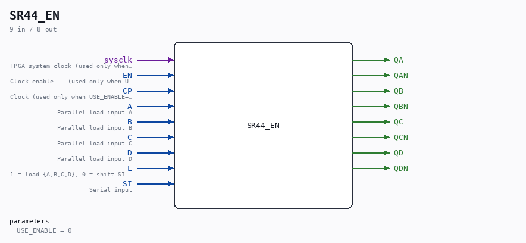

# SR44_EN

Source: `/mnt/e/Dev/Repos/Ronny/nd-120/Verilog/Shared/ndlib/SR44_EN.v`

> Generated by `Verilog/tests/module_doc.py` from the `//!`
> comments in the source. Do not edit by hand - edit the RTL comments and regenerate.

## Description

ND120 Shared
SR44_EN - SR44 (4-bit load/shift register) with an optional
clock-enable mode.
USE_ENABLE=0 (default): wraps the original SR44 - posedge CP,
original behaviour.
USE_ENABLE=1: posedge sysclk, updates when EN is high (P2 clock-
domain conversion mode - see SCAN_FF_EN.v / the plan doc). The
CP pin is unused in this mode.
Behaviour (verified against the Multiplexer_2 wiring in SR44.v):
PLEXERS_1: sel=L, muxIn_1=A,  muxIn_0=SI -> QA d = L ? A : SI
PLEXERS_2: sel=L, muxIn_1=B,  muxIn_0=QA -> QB d = L ? B : QA
PLEXERS_3: sel=L, muxIn_1=C,  muxIn_0=QB -> QC d = L ? C : QB
PLEXERS_4: sel=L, muxIn_1=D,  muxIn_0=QC -> QD d = L ? D : QC
So: L=1 loads {A,B,C,D} into {QA,QB,QC,QD}; L=0 shifts
SI -> QA -> QB -> QC -> QD. With q_r[0]=QA .. q_r[3]=QD this is
q_r <= L ? {D,C,B,A} : {q_r[2:0], SI};
Last reviewed: 10-JUL-2026
Ronny Hansen

## Parameters

| Parameter | Default |
|---|---|
| `USE_ENABLE` | `0` |

## Ports

| Direction | Width | Name | Description |
|---|---|---|---|
| input | `1` | `sysclk` | FPGA system clock (used only when USE_ENABLE=1) |
| input | `1` | `EN` | Clock enable    (used only when USE_ENABLE=1) |
| input | `1` | `CP` | Clock (used only when USE_ENABLE=0) |
| input | `1` | `A` | Parallel load input A |
| input | `1` | `B` | Parallel load input B |
| input | `1` | `C` | Parallel load input C |
| input | `1` | `D` | Parallel load input D |
| input | `1` | `L` | 1 = load {A,B,C,D}, 0 = shift SI -> QA -> QB -> QC -> QD |
| input | `1` | `SI` | Serial input |
| output | `1` | `QA` |  |
| output | `1` | `QAN` |  |
| output | `1` | `QB` |  |
| output | `1` | `QBN` |  |
| output | `1` | `QC` |  |
| output | `1` | `QCN` |  |
| output | `1` | `QD` |  |
| output | `1` | `QDN` |  |
