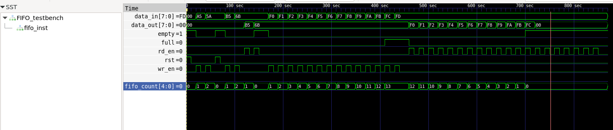

# Verilog verification of FIFO 8-bit

## Test program verification

* Apply reset signal
* Write some data to FIFO (should not be saved as long as reset signal is active)
* Clear reset signal
* Write some more data to FIFO
* Read data back from FIFO
* _Check FULL and EMPTY flags_
* Overflow the FIFO
* _Check FULL and EMPTY flags_
* Read the data back from FIFO
* _Check FULL and EMPTY flags_

