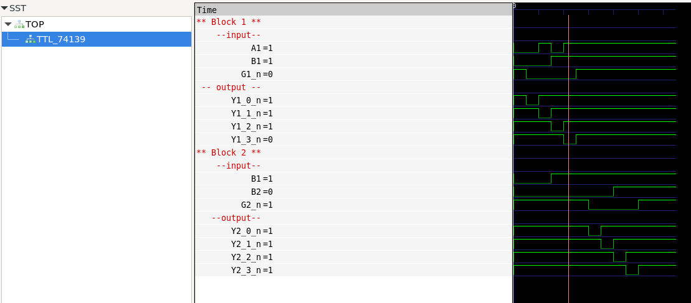

# TTL 74139

The 74139 is a Dual 1-of-4 Decoder/Demultiplexer, often used in digital circuits.

It has two identical and independent 1-of-4 decoders. Each decoder has two select inputs (A, B), two active low enable inputs (/G1, /G2), and four active low outputs (/Y0, /Y1, /Y2, /Y3).

## Test program verification

## Truth Table for the chip

| /G1 | /G2 | A  | B  | /Y0 | /Y1 | /Y2 | /Y3 |
|-----|-----|----|----|-----|-----|-----|-----|
|  1  |  X  |  X |  X |  1  |  1  |  1  |  1  |
|  X  |  1  |  X |  X |  1  |  1  |  1  |  1  |
|  0  |  0  |  0 |  0 |  0  |  1  |  1  |  1  |
|  0  |  0  |  1 |  0 |  1  |  0  |  1  |  1  |
|  0  |  0  |  0 |  1 |  1  |  1  |  0  |  1  |
|  0  |  0  |  1 |  1 |  1  |  1  |  1  |  0  |

# Explanation

/G1 and /G2 are enable inputs (active low). When either /G1 or /G2 is high, all outputs (/Y0, /Y1, /Y2, /Y3) will be high (1), regardless of the inputs A and B.
When both /G1 and /G2 are low (0), the outputs are determined by the select inputs A and B.
A and B are select inputs. They determine which one of the four outputs (/Y0, /Y1, /Y2, /Y3) is low (0).
/Y0, /Y1, /Y2, /Y3 are the active low outputs. Only one of them will be low at a time, depending on the combination of A and B when /G1 and /G2 are both low.

# Select Inputs (A, B) to Output Mapping:

00 maps to /Y0
01 maps to /Y1
10 maps to /Y2
11 maps to /Y3