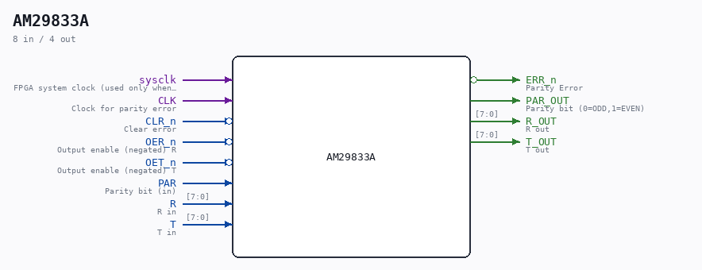

# AM29833A

Source: `/mnt/e/Dev/Repos/Ronny/nd-120/Verilog/Shared/support/AM29833A.v`

> Generated by `Verilog/tests/module_doc.py` from the `//!`
> comments in the source. Do not edit by hand - edit the RTL comments and regenerate.

## Description

ND120 Shared
Module AM29833A
PARITY BUS TRANSCEIVERS
Documentation:
https://pdf1.alldatasheet.com/datasheet-pdf/view/165880/AMD/AM29833A.html
Last reviewed: 22-MAR-2025
Ronny Hansen

## Ports

| Direction | Width | Name | Description |
|---|---|---|---|
| input | `1` | `sysclk` | FPGA system clock (used only when USE_SYSCLK=2) |
| input | `1` | `CLK` | Clock for parity error |
| input | `1` | `CLR_n` *(active low)* | Clear error |
| output | `1` | `ERR_n` *(active low)* | Parity Error |
| input | `1` | `OER_n` *(active low)* | Output enable (negated) R |
| input | `1` | `OET_n` *(active low)* | Output enable (negated) T |
| input | `1` | `PAR` | Parity bit (in) |
| output | `1` | `PAR_OUT` | Parity bit (0=ODD,1=EVEN) |
| input | `[7:0]` | `R` | R in |
| output | `[7:0]` | `R_OUT` | R out |
| input | `[7:0]` | `T` | T in |
| output | `[7:0]` | `T_OUT` | T out |
