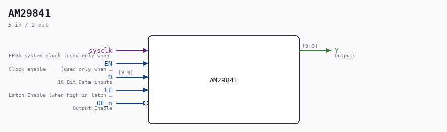

# AM29841

Source: `/mnt/e/Dev/Repos/Ronny/nd-120/Verilog/Shared/support/AM29841.v`

> Generated by `Verilog/tests/module_doc.py` from the `//!`
> comments in the source. Do not edit by hand - edit the RTL comments and regenerate.

## Description

ND120 Shared
Component AM29841
Bus Driver 10 bit (D-Latch) with 3-state output
Documentation: https://www.alldatasheet.com/datasheet-pdf/pdf/107079/AMD/AM29841.html
Last reviewed: 1-DEC-2024
Ronny Hansen

## Ports

| Direction | Width | Name | Description |
|---|---|---|---|
| input | `1` | `sysclk` | FPGA system clock (used only when USE_ENABLE=1) |
| input | `1` | `EN` | Clock enable     (used only when USE_ENABLE=1) |
| input | `[9:0]` | `D` | 10 Bit Data inputs |
| input | `1` | `LE` | Latch Enable (when high in latch mode, rising edge in FF mode) |
| input | `1` | `OE_n` *(active low)* | Output Enable |
| output | `[9:0]` | `Y` | Outputs |
