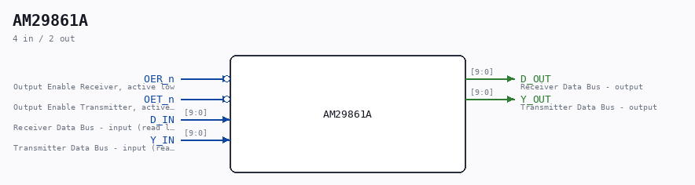

# AM29861A

Source: `/mnt/e/Dev/Repos/Ronny/nd-120/Verilog/Shared/support/AM29861A.v`

> Generated by `Verilog/tests/module_doc.py` from the `//!`
> comments in the source. Do not edit by hand - edit the RTL comments and regenerate.

## Description

ND120 CPU
AM29861A
10 Bit Bus Tranceivers
Documentation:
https://datasheetspdf.com/datasheet/AM29861.html
Last reviewed: 11-NOV-2024
Ronny Hansen

## Ports

| Direction | Width | Name | Description |
|---|---|---|---|
| input | `1` | `OER_n` *(active low)* | Output Enable Receiver, active low |
| input | `1` | `OET_n` *(active low)* | Output Enable Transmitter, active low |
| input | `[9:0]` | `D_IN` | Receiver Data Bus - input (read left, write right) |
| input | `[9:0]` | `Y_IN` | Transmitter Data Bus - input (read right, write left) |
| output | `[9:0]` | `D_OUT` | Receiver Data Bus - output |
| output | `[9:0]` | `Y_OUT` | Transmitter Data Bus - output |
