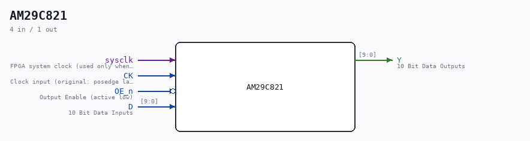

# AM29C821

Source: `/mnt/e/Dev/Repos/Ronny/nd-120/Verilog/Shared/support/AM29C821.v`

> Generated by `Verilog/tests/module_doc.py` from the `//!`
> comments in the source. Do not edit by hand - edit the RTL comments and regenerate.

## Description

ND120 CPU
AM29C821
Bus Driver 10 bits.
Positive edge-triggered registers with D-type flip-flops and 3-state
Documentation:
https://www.digikey.com/en/products/detail/rochester-electronics-llc/AM29C821-BLA/12095382
Last reviewed: 11-NOV-2024
Ronny Hansen

## Ports

| Direction | Width | Name | Description |
|---|---|---|---|
| input | `1` | `sysclk` | FPGA system clock (used only when USE_SYSCLK=1) |
| input | `1` | `CK` | Clock input (original: posedge latch) |
| input | `1` | `OE_n` *(active low)* | Output Enable (active low) |
| input | `[9:0]` | `D` | 10 Bit Data Inputs |
| output | `[9:0]` | `Y` | 10 Bit Data Outputs |
