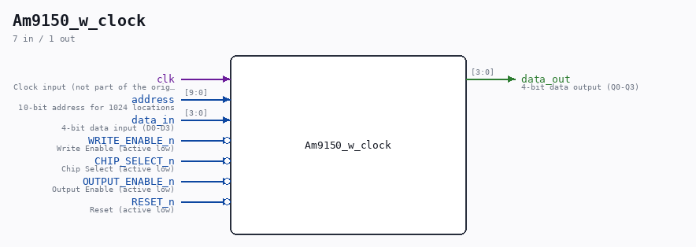

# Am9150_w_clock

Source: `/mnt/e/Dev/Repos/Ronny/nd-120/Verilog/Shared/support/Am9150_with_clk.v`

> Generated by `Verilog/tests/module_doc.py` from the `//!`
> comments in the source. Do not edit by hand - edit the RTL comments and regenerate.

## Description

Am9150 1024x4 High-Speed Static R/W RAM
DISTINCTIVE CHARACTERISTICS
• 1024 x 4 organization
• High speed - 20 ns Max. access time
• Separate data inputs and outputs
• Memory reset function
• High density SLIM 24-pin 300-MIL package
• Three-state output buffers
• Single + 5 V power supply ± 10%
• Low-power version
GENERAL DESCRIPTION
The Am9150 is a high-performance, static, n-channel, read/write, random-access memory organized as 1024 x 4.
It features single 5 V supply operation, TTL-compatible input and output levels, and separate input and output pins for improved system performance and ease of use.
The Am9150 also incorporates a reset feature which will reset the entire contents of the memory to logical LOW in two cycle times by controlling /R (RESET) and /S (CS).
The Am9150 has four control signals /R, /S, /W and /G.
The /S input controls read, write and reset operations of the device and provides for easy selection of an individual device when the outputs are tied together.
The /W (/WE) input controls the normal read and write operations, and the /G (/OE) controls the state of the outputs.
http://www.sintran.com/library/libother/extern/AM9150.pdf

## Ports

| Direction | Width | Name | Description |
|---|---|---|---|
| input | `1` | `clk` | Clock input (not part of the original Am9150, but useful for simulation) |
| input | `[9:0]` | `address` | 10-bit address for 1024 locations |
| input | `[3:0]` | `data_in` | 4-bit data input (D0-D3) |
| output | `[3:0]` | `data_out` | 4-bit data output (Q0-Q3) |
| input | `1` | `WRITE_ENABLE_n` *(active low)* | Write Enable (active low) |
| input | `1` | `CHIP_SELECT_n` *(active low)* | Chip Select (active low) |
| input | `1` | `OUTPUT_ENABLE_n` *(active low)* | Output Enable (active low) |
| input | `1` | `RESET_n` *(active low)* | Reset (active low) |
