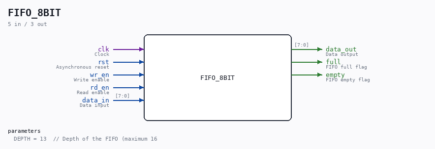

# FIFO_8BIT

Source: `/mnt/e/Dev/Repos/Ronny/nd-120/Verilog/Shared/support/FIFO_8BIT.v`

> Generated by `Verilog/tests/module_doc.py` from the `//!`
> comments in the source. Do not edit by hand - edit the RTL comments and regenerate.

## Description

FIFO 8 bit
Last reviewed: 11-NOV-2024
Ronny Hansen

## Parameters

| Parameter | Default |
|---|---|
| `DEPTH` | `13  // Depth of the FIFO (maximum 16` |

## Ports

| Direction | Width | Name | Description |
|---|---|---|---|
| input | `1` | `clk` | Clock |
| input | `1` | `rst` | Asynchronous reset |
| input | `1` | `wr_en` | Write enable |
| input | `1` | `rd_en` | Read enable |
| input | `[7:0]` | `data_in` | Data input |
| output | `[7:0]` | `data_out` | Data output |
| output | `1` | `full` | FIFO full flag |
| output | `1` | `empty` | FIFO empty flag |
