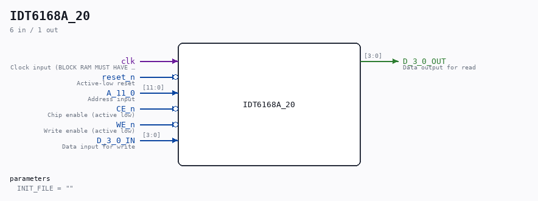

# IDT6168A_20

Source: `/mnt/e/Dev/Repos/Ronny/nd-120/Verilog/Shared/support/IDT6168A_20.v`

> Generated by `Verilog/tests/module_doc.py` from the `//!`
> comments in the source. Do not edit by hand - edit the RTL comments and regenerate.

## Description

ND120 Shared
IDT6168A
16K (4Kx4) Static RAM  (using BLOCK RAM)
Last reviewed: 29-JAN-2025
Ronny Hansen

## Parameters

| Parameter | Default |
|---|---|
| `INIT_FILE` | `""` |

## Ports

| Direction | Width | Name | Description |
|---|---|---|---|
| input | `1` | `clk` | Clock input (BLOCK RAM MUST HAVE CLOCK) |
| input | `1` | `reset_n` *(active low)* | Active-low reset |
| input | `[11:0]` | `A_11_0` | Address input |
| input | `1` | `CE_n` *(active low)* | Chip enable (active low) |
| input | `1` | `WE_n` *(active low)* | Write enable (active low) |
| input | `[3:0]` | `D_3_0_IN` | Data input for write |
| output | `[3:0]` | `D_3_0_OUT` | Data output for read |
