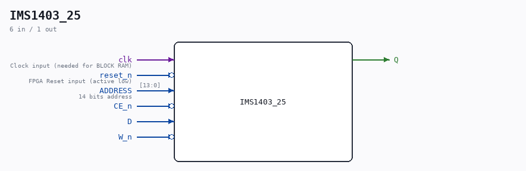

# IMS1403_25

Source: `/mnt/e/Dev/Repos/Ronny/nd-120/Verilog/Shared/support/IMS1403_25.v`

> Generated by `Verilog/tests/module_doc.py` from the `//!`
> comments in the source. Do not edit by hand - edit the RTL comments and regenerate.

## Description

ND120 Shared
Component : IMS1403_25
16K x 1 Static RAM
Last reviewed: 9-FEB-2025
Ronny Hansen

## Ports

| Direction | Width | Name | Description |
|---|---|---|---|
| input | `1` | `clk` | Clock input (needed for BLOCK RAM) |
| input | `1` | `reset_n` *(active low)* | FPGA Reset input (active low) |
| input | `[13:0]` | `ADDRESS` | 14 bits address |
| input | `1` | `CE_n` *(active low)* |  |
| input | `1` | `D` |  |
| input | `1` | `W_n` *(active low)* |  |
| output | `1` | `Q` |  |
