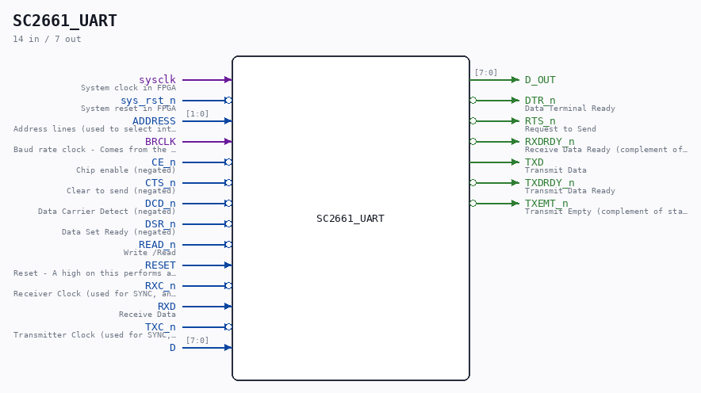

# SC2661_UART

Source: `/mnt/e/Dev/Repos/Ronny/nd-120/Verilog/Shared/support/SC2661_UART.v`

> Generated by `Verilog/tests/module_doc.py` from the `//!`
> comments in the source. Do not edit by hand - edit the RTL comments and regenerate.

## Description

SC2661 UART
The SC2661 is a UART (Universal Asynchronous Receiver/Transmitter) chip
Last reviewed: 9-FEB-2025
Ronny Hansen

## Ports

| Direction | Width | Name | Description |
|---|---|---|---|
| input | `1` | `sysclk` | System clock in FPGA |
| input | `1` | `sys_rst_n` *(active low)* | System reset in FPGA |
| input | `[1:0]` | `ADDRESS` | Address lines (used to select internal EPCI registers) |
| input | `1` | `BRCLK` | Baud rate clock - Comes from the IO_DCD module. 4.9152Mhz |
| input | `1` | `CE_n` *(active low)* | Chip enable (negated) |
| input | `1` | `CTS_n` *(active low)* | Clear to send (negated) |
| input | `1` | `DCD_n` *(active low)* | Data Carrier Detect (negated) |
| input | `1` | `DSR_n` *(active low)* | Data Set Ready (negated) |
| input | `1` | `READ_n` *(active low)* | Write /Read |
| input | `1` | `RESET` | Reset - A high on this performs a master reset of the chip |
| input | `1` | `RXC_n` *(active low)* | Receiver Clock (used for SYNC, and not implemented) |
| input | `1` | `RXD` | Receive Data |
| input | `1` | `TXC_n` *(active low)* | Transmitter Clock (used for SYNC, and not implemented) |
| input | `[7:0]` | `D` |  |
| output | `[7:0]` | `D_OUT` |  |
| output | `1` | `DTR_n` *(active low)* | Data Terminal Ready |
| output | `1` | `RTS_n` *(active low)* | Request to Send |
| output | `1` | `RXDRDY_n` *(active low)* | Receive Data Ready (complement of status register bit SR1) |
| output | `1` | `TXD` | Transmit Data |
| output | `1` | `TXDRDY_n` *(active low)* | Transmit Data Ready |
| output | `1` | `TXEMT_n` *(active low)* | Transmit Empty (complement of status register bit SR2) |
