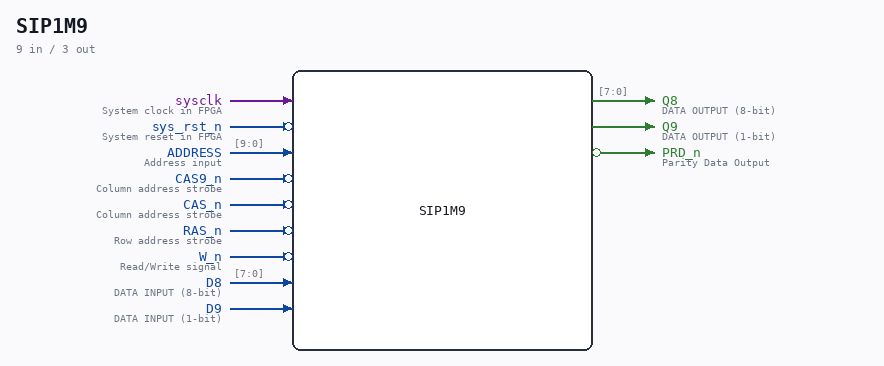

# SIP1M9

Source: `/mnt/e/Dev/Repos/Ronny/nd-120/Verilog/Shared/support/SIP1M9.v`

> Generated by `Verilog/tests/module_doc.py` from the `//!`
> comments in the source. Do not edit by hand - edit the RTL comments and regenerate.

## Description

RAM CHIP 1 MBYTE (1024KB)
This ram has PARITY bit..
THM91020 - http://norsk-data.com/library/libother/extern/THM91020.pdf
THM91070 - http://norsk-data.com/library/libother/extern/THM91070.pdf
Last reviewed: 9-FEB-2025
Ronny Hansen

## Ports

| Direction | Width | Name | Description |
|---|---|---|---|
| input | `1` | `sysclk` | System clock in FPGA |
| input | `1` | `sys_rst_n` *(active low)* | System reset in FPGA |
| input | `[9:0]` | `ADDRESS` | Address input |
| input | `1` | `CAS9_n` *(active low)* | Column address strobe |
| input | `1` | `CAS_n` *(active low)* | Column address strobe |
| input | `1` | `RAS_n` *(active low)* | Row address strobe |
| input | `1` | `W_n` *(active low)* | Read/Write signal |
| input | `[7:0]` | `D8` | DATA INPUT (8-bit) |
| input | `1` | `D9` | DATA INPUT (1-bit) |
| output | `[7:0]` | `Q8` | DATA OUTPUT (8-bit) |
| output | `1` | `Q9` | DATA OUTPUT (1-bit) |
| output | `1` | `PRD_n` *(active low)* | Parity Data Output |
