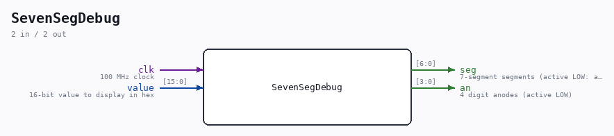

# SevenSegDebug

Source: `/mnt/e/Dev/Repos/Ronny/nd-120/Verilog/Shared/support/SevenSegDebug.v`

> Generated by `Verilog/tests/module_doc.py` from the `//!`
> comments in the source. Do not edit by hand - edit the RTL comments and regenerate.

## Description

7-Segment Display Debug Module for Basys3
Displays a 16-bit value on the 4-digit 7-segment display.
Multiplexes between digits at ~1 KHz refresh rate.
Basys3 7-seg: active LOW segments, active LOW digit anodes
Accent: Accent bit (h/H) at 4th bit of digit_select -> dot
Last reviewed: 30-MAR-2026
Ronny Hansen

## Ports

| Direction | Width | Name | Description |
|---|---|---|---|
| input | `1` | `clk` | 100 MHz clock |
| input | `[15:0]` | `value` | 16-bit value to display in hex |
| output | `[6:0]` | `seg` | 7-segment segments (active LOW: a,b,c,d,e,f,g) |
| output | `[3:0]` | `an` | 4 digit anodes (active LOW) |
