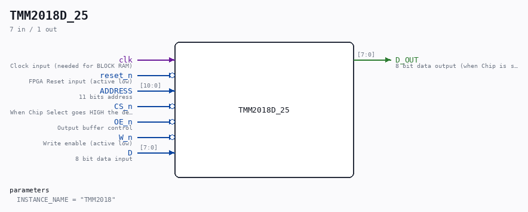

# TMM2018D_25

Source: `/mnt/e/Dev/Repos/Ronny/nd-120/Verilog/Shared/support/TMM2018D_25.v`

> Generated by `Verilog/tests/module_doc.py` from the `//!`
> comments in the source. Do not edit by hand - edit the RTL comments and regenerate.

## Description

ND120 Shared
TMM2018D_25 | 16K bit Static RAM (Used by Cache and Page Tables)
PDF doc: https://www.alldatasheet.com/datasheet-pdf/view/113475/TOSHIBA/TMM2018AP.html
Last reviewed: 26-JANUARY-2025
Ronny Hansen

## Parameters

| Parameter | Default |
|---|---|
| `INSTANCE_NAME` | `"TMM2018"` |

## Ports

| Direction | Width | Name | Description |
|---|---|---|---|
| input | `1` | `clk` | Clock input (needed for BLOCK RAM) |
| input | `1` | `reset_n` *(active low)* | FPGA Reset input (active low) |
| input | `[10:0]` | `ADDRESS` | 11 bits address |
| input | `1` | `CS_n` *(active low)* | When Chip Select goes HIGH the device is deselected is placed in low-power mode |
| input | `1` | `OE_n` *(active low)* | Output buffer control |
| input | `1` | `W_n` *(active low)* | Write enable (active low) |
| input | `[7:0]` | `D` | 8 bit data input |
| output | `[7:0]` | `D_OUT` | 8 bit data output (when Chip is selected, no write, and output is enabled) |
