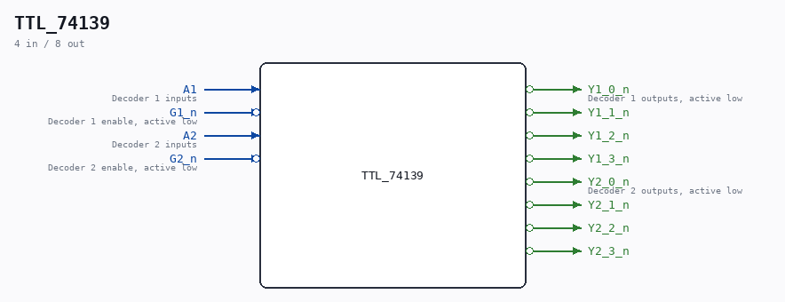

# TTL_74139

Source: `/mnt/e/Dev/Repos/Ronny/nd-120/Verilog/Shared/support/TTL_74139.v`

> Generated by `Verilog/tests/module_doc.py` from the `//!`
> comments in the source. Do not edit by hand - edit the RTL comments and regenerate.

## Description

TTL 74139
DUAL 2-LINE to 4-LINE DECODERS/DEMULTIPLEXERS
https://www.ti.com/lit/ds/symlink/sn54ls139a-sp.pdf?ts=1702906423213

## Ports

| Direction | Width | Name | Description |
|---|---|---|---|
| input | `1` | `A1` | Decoder 1 inputs |
| input | `1` | `G1_n` *(active low)* | Decoder 1 enable, active low |
| output | `1` | `Y1_0_n` *(active low)* | Decoder 1 outputs, active low |
| output | `1` | `Y1_1_n` *(active low)* |  |
| output | `1` | `Y1_2_n` *(active low)* |  |
| output | `1` | `Y1_3_n` *(active low)* |  |
| input | `1` | `A2` | Decoder 2 inputs |
| input | `1` | `G2_n` *(active low)* | Decoder 2 enable, active low |
| output | `1` | `Y2_0_n` *(active low)* | Decoder 2 outputs, active low |
| output | `1` | `Y2_1_n` *(active low)* |  |
| output | `1` | `Y2_2_n` *(active low)* |  |
| output | `1` | `Y2_3_n` *(active low)* |  |
