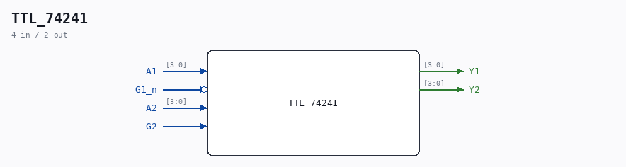

# TTL_74241

Source: `/mnt/e/Dev/Repos/Ronny/nd-120/Verilog/Shared/support/TTL_74241.v`

> Generated by `Verilog/tests/module_doc.py` from the `//!`
> comments in the source. Do not edit by hand - edit the RTL comments and regenerate.

## Description

Component : TTL_74241
buffers with TTL-compatible CMOS inputs and 3-state outputs
https://www.ti.com/product/SN74ABT241A

## Ports

| Direction | Width | Name | Description |
|---|---|---|---|
| input | `[3:0]` | `A1` |  |
| output | `[3:0]` | `Y1` |  |
| input | `1` | `G1_n` *(active low)* |  |
| input | `[3:0]` | `A2` |  |
| output | `[3:0]` | `Y2` |  |
| input | `1` | `G2` |  |
