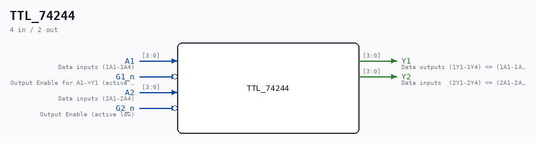

# TTL_74244

Source: `/mnt/e/Dev/Repos/Ronny/nd-120/Verilog/Shared/support/TTL_74244.v`

> Generated by `Verilog/tests/module_doc.py` from the `//!`
> comments in the source. Do not edit by hand - edit the RTL comments and regenerate.

## Ports

| Direction | Width | Name | Description |
|---|---|---|---|
| input | `[3:0]` | `A1` | Data inputs (1A1-1A4) |
| input | `1` | `G1_n` *(active low)* | Output Enable for A1->Y1 (active low) |
| output | `[3:0]` | `Y1` | Data outputs (1Y1-1Y4) <= (1A1-1A4) |
| input | `[3:0]` | `A2` | Data inputs (2A1-2A4) |
| input | `1` | `G2_n` *(active low)* | Output Enable (active low) |
| output | `[3:0]` | `Y2` | Data inputs  (2Y1-2Y4) <= (2A1-2A4) |
