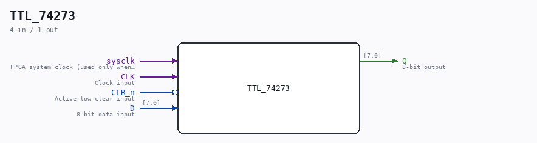

# TTL_74273

Source: `/mnt/e/Dev/Repos/Ronny/nd-120/Verilog/Shared/support/TTL_74273.v`

> Generated by `Verilog/tests/module_doc.py` from the `//!`
> comments in the source. Do not edit by hand - edit the RTL comments and regenerate.

## Description

74273
OCTAL D-TYPE FLIP-FLOP WITH COMMON CLOCK AND ASYNCHRONOUS CLEAR
(NONE NEGATING)
Documentation:  https://www.ti.com/lit/ds/symlink/sn54ls273-sp.pdf
Last reviewed: 26-JAN-2025
Ronny Hansen

## Ports

| Direction | Width | Name | Description |
|---|---|---|---|
| input | `1` | `sysclk` | FPGA system clock (used only when USE_SYSCLK=2) |
| input | `1` | `CLK` | Clock input |
| input | `1` | `CLR_n` *(active low)* | Active low clear input |
| input | `[7:0]` | `D` | 8-bit data input |
| output | `[7:0]` | `Q` | 8-bit output |
