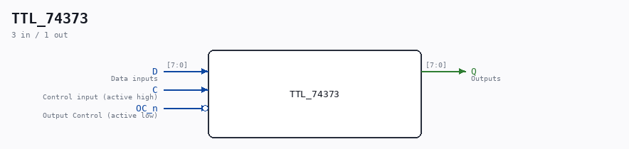

# TTL_74373

Source: `/mnt/e/Dev/Repos/Ronny/nd-120/Verilog/Shared/support/TTL_74373.v`

> Generated by `Verilog/tests/module_doc.py` from the `//!`
> comments in the source. Do not edit by hand - edit the RTL comments and regenerate.

## Description

ND120 Shared
Module 74PCT373
Octal D-TYPE Transparent Latch with 3-state outputs
Documentation: https://www.ti.com/lit/ds/symlink/sn54ls373-sp.pdf
Last reviewed: 1-DEC-2024
Ronny Hansen

## Ports

| Direction | Width | Name | Description |
|---|---|---|---|
| input | `[7:0]` | `D` | Data inputs |
| input | `1` | `C` | Control input (active high) |
| input | `1` | `OC_n` *(active low)* | Output Control (active low) |
| output | `[7:0]` | `Q` | Outputs |
