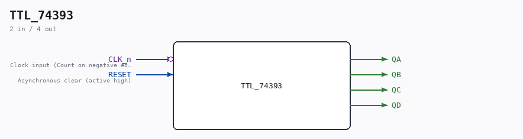

# TTL_74393

Source: `/mnt/e/Dev/Repos/Ronny/nd-120/Verilog/Shared/support/TTL_74393.v`

> Generated by `Verilog/tests/module_doc.py` from the `//!`
> comments in the source. Do not edit by hand - edit the RTL comments and regenerate.

## Ports

| Direction | Width | Name | Description |
|---|---|---|---|
| input | `1` | `CLK_n` *(active low)* | Clock input (Count on negative edge) |
| input | `1` | `RESET` | Asynchronous clear (active high) |
| output | `1` | `QA` |  |
| output | `1` | `QB` |  |
| output | `1` | `QC` |  |
| output | `1` | `QD` |  |
