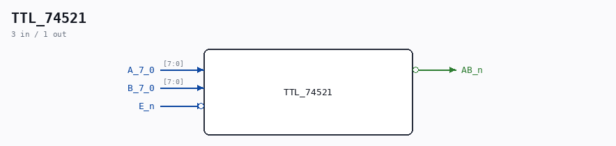

# TTL_74521

Source: `/mnt/e/Dev/Repos/Ronny/nd-120/Verilog/Shared/support/TTL_74521.v`

> Generated by `Verilog/tests/module_doc.py` from the `//!`
> comments in the source. Do not edit by hand - edit the RTL comments and regenerate.

## Description

ND120 Shared
Component: MUX81
Last reviewed: 9-NOV-2024
Ronny Hansen

## Ports

| Direction | Width | Name | Description |
|---|---|---|---|
| input | `[7:0]` | `A_7_0` |  |
| input | `[7:0]` | `B_7_0` |  |
| input | `1` | `E_n` *(active low)* |  |
| output | `1` | `AB_n` *(active low)* |  |
