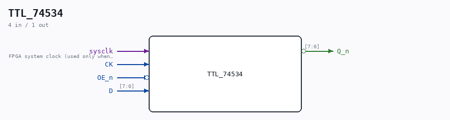

# TTL_74534

Source: `/mnt/e/Dev/Repos/Ronny/nd-120/Verilog/Shared/support/TTL_74534.v`

> Generated by `Verilog/tests/module_doc.py` from the `//!`
> comments in the source. Do not edit by hand - edit the RTL comments and regenerate.

## Description

Component : TTL_74534
74HC534 Octal D-type Flip-Flop
(NEGATED OUTPUTS)

## Ports

| Direction | Width | Name | Description |
|---|---|---|---|
| input | `1` | `sysclk` | FPGA system clock (used only when USE_SYSCLK=2) |
| input | `1` | `CK` |  |
| input | `1` | `OE_n` *(active low)* |  |
| input | `[7:0]` | `D` |  |
| output | `[7:0]` | `Q_n` *(active low)* |  |
