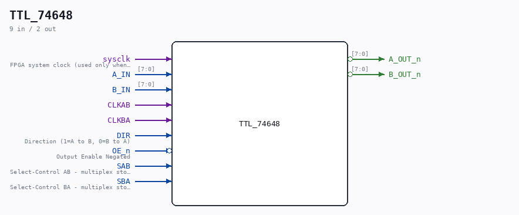

# TTL_74648

Source: `/mnt/e/Dev/Repos/Ronny/nd-120/Verilog/Shared/support/TTL_74648.v`

> Generated by `Verilog/tests/module_doc.py` from the `//!`
> comments in the source. Do not edit by hand - edit the RTL comments and regenerate.

## Description

Component : TTL_74648
OCTAL BUS TRANSCEIVERS AND REGISTERS WITH 3-STATE OUTPUTS
(INVERTING)
DOC: https://www.ti.com/lit/ds/symlink/sn54as646.pdf
Last reviewed: 9-MAR-2025
Ronny Hansen

## Ports

| Direction | Width | Name | Description |
|---|---|---|---|
| input | `1` | `sysclk` | FPGA system clock (used only when USE_SYSCLK_AB/BA=2) |
| input | `[7:0]` | `A_IN` |  |
| input | `[7:0]` | `B_IN` |  |
| input | `1` | `CLKAB` |  |
| input | `1` | `CLKBA` |  |
| input | `1` | `DIR` | Direction (1=A to B, 0=B to A) |
| input | `1` | `OE_n` *(active low)* | Output Enable Negated |
| input | `1` | `SAB` | Select-Control AB - multiplex stored and real-time (transparent mode) registeres |
| input | `1` | `SBA` | Select-Control BA - multiplex stored and real-time (transparent mode) registeres. 0=REAL-TIME |
| output | `[7:0]` | `A_OUT_n` *(active low)* |  |
| output | `[7:0]` | `B_OUT_n` *(active low)* |  |
