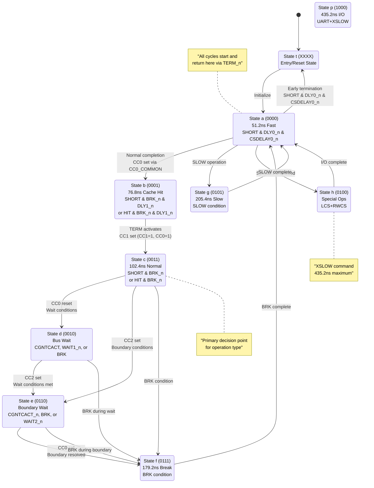

# ND-120 CPU Cycle Clock (CC) Analysis

## Overview

The ND-120 CPU implements a sophisticated cycle control system using a 4-bit cycle counter (CC3, CC2, CC1, CC0) that sequences through different timing states. This analysis examines the behavior of the Cycle Clock (CC) signals and their state machine implementation.

## DELILAH Cycle Control State Diagram

### Historical Context

The ND-120 CPU featured a complete redesign using VLSI gate array technology, representing a significant advancement in the ND-100 series:

- **Complete VLSI Implementation**: One big gate array called the "Delilah chip" with a helper DELILAH Decoding Logic Gate Array (DGA)
- **Performance**: Approximately 1.9 times faster than the ND-110/CX
- **Microcode Architecture**: Downloadable microcode stored in RAM rather than PROM
- **I/O Compatibility**: Support for very slow I/O devices through extended timing cycles
- **Software Compatibility**: Maintained compatibility with existing ND-100 ecosystem

### DELILAH State Machine Architecture

The DELILAH cycle controller defines the timing sequence for executing microinstructions and manages different types of memory operations, from fast cache hits to slow I/O device access. The finite state machine manages memory access cycles and timing with hierarchical timing that progressively increases for more complex operations.

#### State Categories

**Fast Execution States (a, b, c)**
These handle normal CPU operations with progressively longer timing:

- **State 'a' (51.2ns)**: `SHORT*/DLY0*/CSDELAY0` - Initial short cycle delay, fastest execution path
- **State 'b' (76.8ns)**: `SHORT*/BRK*/DLY1 + HIT*/BRK*/DLY1` - Short cycles with break conditions, cache hits
- **State 'c' (102.4ns)**: `SHORT*/BRK + HIT*/BRK` - Gateway to wait states for complex operations

**Wait States (d, e)**
These manage bus arbitration and memory boundary conditions:

- **State 'd'**: `wait for bus - /CGNTCACT*/BRK` with `*WAIT1 (R+W+F+10)` - Bus availability during read/write operations
- **State 'e'**: `wait for bdry - CGNTCACT*/BRK` with `*WAIT2 (R+F+10)` - Memory boundary crossings

**Special Control States (f, g)**
These handle exceptional conditions and slow operations:

- **State 'f' (min. 179.2ns)**: `BRK (trap or cond. brk)` - Interrupt and exception processing
- **State 'g' (min. 205.4ns)**: `SLOW (incl. R+F+10)` - Slow memory operations, complex addressing modes

**Extended Timing States (h, p)**
These accommodate very slow devices:

- **State 'h'**: `(LCS+RWCS+UART+XSLOW)` - Load/Read-Write Command Store, UART operations
- **State 'p' (435.2ns)**: `the rest` - Maximum cycle length for very slow I/O devices

### Complete State Flow Diagram



### Complete Binary State Encoding Table

| State | Binary | Timing | Function |
|-------|--------|--------|----------|
| **t** | XXXX | - | Entry point (undefined/reset state) |
| **a** | 0000 | 51.2ns | Fast cycle |
| **b** | 0001 | 76.8ns | Cache hit cycle |
| **c** | 0011 | 102.4ns | Normal cycle |
| **d** | 0010 | Variable | Bus wait |
| **e** | 0110 | Variable | Boundary wait |
| **f** | 0111 | 179.2ns | Break cycle |
| **g** | 0101 | 205.4ns | Slow cycle |
| **h** | 0100 | Variable | Special operations |
| **i** | 1100 | - | Extended state |
| **j** | 1101 | - | Extended state |
| **k** | 1111 | - | Extended state |
| **l** | 1110 | - | Extended state |
| **m** | 1010 | - | Extended state |
| **n** | 1011 | - | Extended state |
| **o** | 1001 | - | Extended state |
| **p** | 1000 | 435.2ns | Maximum timing (XSLOW) |

## Architecture

### Key Components

The cycle control system is implemented across several modules:

- **PAL_44601B** (`E:\Dev\Repos\Ronny\nd-120\Verilog\PAL\PAL_44601B.v`): Main cycle control state machine (CYCFSM)
- **PAL_44307C** (`E:\Dev\Repos\Ronny\nd-120\Verilog\PAL\PAL_44307C.v`): Cycle clock generator (CYCLK)
- **CYC_36** (`E:\Dev\Repos\Ronny\nd-120\Verilog\CPU-BOARD-3202\circuit\CYC_36.v`): Top-level cycle control module

### Signal Description

| Signal | Source | Description |
|--------|--------|-------------|
| CC0_n | PAL_44601B:Q2_n | Cycle Control 0 (negated) |
| CC1_n | PAL_44601B:Q3_n | Cycle Control 1 (negated) |
| CC2_n | PAL_44601B:Q4_n | Cycle Control 2 (negated) |
| CC3_n | PAL_44601B:Q5_n | Cycle Control 3 (negated) |
| TERM_n | PAL_44601B:Q1_n | Terminate signal (marks end of cycle) |

## State Machine Analysis

The cycle control implements a state machine where transitions are controlled by the TERM signal and specific conditions. Each state has precise entry and exit conditions defined in the Verilog code.

### State Transition Conditions (From Verilog Analysis)

#### State a (0000) - 51.2ns Fast Cycle
**Current State:** `CC3=0, CC2=0, CC1=0, CC0=0`

**TERM Activation Condition (Line 107):**
```verilog
CC3_n & CC2_n & CC1_n & CC0_n & SHORT & DLY0_n & CSDELAY0_n
```

**Transition Logic:**
- **Default Path:** Continue to state b (0001) when timing completes normally
- **Early Termination:** When `SHORT & DLY0_n & CSDELAY0_n` is TRUE:
  - TERM activates → Cycle terminates early → **Return to state t (entry/reset)**
  - **Description:** Early-terminate cycle on short path with DLY0/CSDELAY satisfied
- **When FALSE:** Continue 51.2ns timing, then proceed to state b

**Exit Transition (CC0_COMMON, Line 82):**
```verilog
CC3_n & CC2_n & CC1_n & TERM_n
```
- **When TERM_n=0 (normal completion):** CC0 gets set → **Transition to state b (0001)**
- **When TERM_n=1 (early termination):** Return to entry state
- **Purpose:** Fast cycle for short operations with early termination capability

**Key Insight:**
State A has **conditional branching** - it's not just a simple progression to state B. The early termination mechanism allows the CPU to optimize very short operations by skipping the full timing cycle when the required delays (DLY0, CSDELAY0) are satisfied and the operation is marked as SHORT. This is a sophisticated optimization that allows the ND-120 to achieve maximum performance on operations that can complete faster than the standard 51.2ns cycle time.

#### State b (0001) - 76.8ns Cache Hit Cycle
**Current State:** `CC3=0, CC2=0, CC1=0, CC0=1`

**TERM Activation Conditions (Lines 108-109):**
```verilog
(CC3_n & CC2_n & CC1_n & CC0 & SHORT & BRK_n & DLY1_n) |  // SHORT operations
(CC3_n & CC2_n & CC1_n & CC0 & HIT & BRK_n & DLY1_n)      // Cache HIT operations
```

**Conditional Branching:**

1. **Default Path:** Continue to state c (0011) when TERM activates normally
   ```verilog
   CC3_n & CC2_n & CC0 & TERM_n  // Line 192
   ```
   - CC1 gets set → **Transition to state c (0011)**

2. **Direct to Extended States:** Can branch directly to states with CC3=1
   ```verilog
   CC2 & CC1_n & CC0_n & TERM_n  // Line 135 - Sets CC3=1
   ```
   - When specific conditions require extended operations
   - **Branches to states i, j, k, l, m, n, o, p (1xxx)**

3. **Bus Wait Branch:** Can transition to wait states
   ```verilog
   CC3_n & CC1 & CC0_n & CGNTCACT & TERM_n  // Line 172 - Sets CC2=1
   ```
   - When bus conflicts detected → **Branch to state e (0110) or f (0111)**

**Key Insight:**
State B implements **multi-path conditional branching** where the next state depends on operation requirements detected during the 76.8ns cycle. Rather than always progressing to state C, it can branch directly to extended states (CC3=1) for complex operations or to wait states when bus conflicts are detected. This allows the CPU to dynamically adapt its timing based on real-time system conditions.

#### State c (0011) - 102.4ns Normal Cycle
**Current State:** `CC3=0, CC2=0, CC1=1, CC0=1`

**TERM Activation Conditions (Lines 110-111):**
```verilog
(CC3_n & CC2_n & CC1 & CC0 & SHORT & BRK_n) |  // SHORT operations
(CC3_n & CC2_n & CC1 & CC0 & HIT & BRK_n)      // Cache HIT operations
```

**Conditional Branching:**

1. **To Bus Wait (state d - 0010):** CC0 reset when NOT maintaining previous write
   ```verilog
   // CC0 is maintained (stays in state C) when:
   CC3_n & CC2_n & CC1 & CGNTCACT & BRK_n & TERM_n  // Line 226 - Previous Write

   // CC0 is reset (transition C→D) when Previous Write condition is FALSE:
   // NOT(CGNTCACT & BRK_n) - Previous write not active
   ```
   - **Description:** State C transitions to D when "Previous Write" conditions are not met
   - **Correct Statement:** State C **stays in C** if 'Previous Write' (CGNTCACT & BRK_n), **transitions to D** when Previous Write is false

2. **To Boundary Wait (state e - 0110):** CC2 set when boundary conditions met
   ```verilog
   CC3_n & CC1 & CC0_n & CGNTCACT & TERM_n  // Line 172 - CC2 set
   CC3_n & CC1 & CC0_n & WAIT1_n & TERM_n   // WAIT1 conditions
   CC3_n & CC1 & CC0_n & BRK & TERM_n       // Break conditions
   ```

3. **To Extended States:** Direct branch to states with CC3=1
   ```verilog
   CC2 & CC1_n & CC0_n & TERM_n  // Line 135 - Sets CC3=1
   ```

4. **Continue Normal Operation:** Based on completion conditions
   - Return via CC0_COMMON when cycle completes normally

**Key Insight:**
State C acts as the **primary decision point** in the cycle control state machine. During the 102.4ns cycle, it continuously monitors system conditions (bus grants, cache status, wait states, break conditions) and dynamically branches to the appropriate next state. This makes it the most sophisticated branching state, capable of directing execution to wait states, extended operations, or normal completion based on real-time system requirements.

#### State d (0010) - Bus Wait
**Current State:** `CC3=0, CC2=0, CC1=1, CC0=0`

**Conditional Branching:**

1. **To Boundary Wait (state e - 0110):** When bus becomes available
   ```verilog
   (CC3_n & CC1 & CC0_n & CGNTCACT & TERM_n) |   // Bus grant/active
   (CC3_n & CC1 & CC0_n & WAIT1_n & TERM_n) |    // Wait state 1 resolved
   (CC3_n & CC1 & CC0_n & BRK & TERM_n)          // Break condition
   ```
   - CC2 gets set → **Transition to state e (0110)**

2. **To Extended States:** When extended operations required
   ```verilog
   CC2 & CC1_n & CC0_n & TERM_n  // Line 135 - Sets CC3=1
   ```
   - **Branches to states i, j, k, l, m, n, o, p (1xxx)**

3. **Return to Entry:** When wait resolves without further requirements
   - Via CC0_COMMON when conditions clear

**Key Insight:**
State D implements **adaptive wait resolution** where the duration and exit path depend on system bus conditions. It can escalate to boundary wait (state E) when bus access is granted, branch to extended states for complex operations, or return to normal flow when simple wait conditions are resolved.

#### State e (0110) - Boundary Wait
**Current State:** `CC3=0, CC2=1, CC1=1, CC0=0`

**Conditional Branching:**

1. **To Break Cycle (state f - 0111):** When boundary conditions resolve
   ```verilog
   (CC3_n & CC2 & CC1 & CGNTCACT_n & TERM_n) |    // Wait for bus of location
   (CC3_n & CC2 & CC1 & BRK & TERM_n) |           // Memory cycle to finish
   (CC3_n & CC2 & CC1 & WAIT2_n & TERM_n)         // If WAIT2 and not BRK
   ```
   - CC0 gets set → **Transition to state f (0111)**

2. **To Extended States:** When complex boundary operations required
   ```verilog
   CC2 & CC1_n & CC0_n & TERM_n  // Line 135 - Sets CC3=1
   ```
   - **Branches to states with CC3=1**

3. **Continue Boundary Wait:** When conditions not yet satisfied
   - Remain in state e until boundary conditions resolve

**Key Insight:**
State E manages **memory boundary crossing** with conditional progression. It waits for complex memory boundary conditions to resolve and can either advance to break cycle handling (state F) for final processing or escalate to extended states when boundary crossing requires additional complex operations. The state duration is variable and depends on memory subsystem response times.

#### State f (0111) - 179.2ns Break Cycle
**Current State:** `CC3=0, CC2=1, CC1=1, CC0=1`

**TERM Activation Condition (Line 112):**
```verilog
CC3_n & CC2 & CC1 & CC0 & BRK
```

**Conditional Branching:**

1. **To Extended States:** When break handling requires complex operations
   ```verilog
   CC2 & CC1_n & CC0_n & TERM_n  // Line 135 - Sets CC3=1
   ```
   - **Branches to states i, j, k, l, m, n, o, p (1xxx)**

2. **Return to Entry:** When break/trap handling completes
   - Via CC0_COMMON when BRK conditions are satisfied
   - **Return to state t/a** for normal operation restart

**Key Insight:**
State F handles **exception and break processing** with conditional escalation. While primarily a 179.2ns break cycle, it can branch to extended states when break handling involves complex operations (interrupts, traps, exception vectors). This ensures proper exception handling while maintaining the ability to escalate to longer cycles when needed.

#### State g (0101) - 205.4ns Slow Cycle
**Current State:** `CC3=0, CC2=1, CC1=0, CC0=1`

**TERM Activation Condition (Line 113):**
```verilog
CC3_n & CC2 & CC1_n & CC0 & SLOW
```

**Conditional Branching:**

1. **To Extended States:** When slow operations require maximum timing
   ```verilog
   CC2 & CC1_n & CC0_n & TERM_n  // Line 135 - Sets CC3=1
   ```
   - **Branches to states i, j, k, l, m, n, o, p (1xxx)**
   - Especially to state p (1000) for XSLOW operations

2. **Return to Entry:** When slow operation completes
   - Via CC0_COMMON when SLOW conditions are satisfied
   - **Return to state t/a** for normal operation restart

**Key Insight:**
State G manages **complex slow operations** with conditional escalation to maximum timing states. While providing 205.4ns for most slow operations, it can branch to extended states (especially state P with 435.2ns) when operations require XSLOW timing for very slow devices like UART. This creates a hierarchical timing system where each level can escalate to the next when needed.

#### State h (0100) - Special Operations
**Current State:** `CC3=0, CC2=1, CC1=0, CC0=0`

**Conditional Branching:**

1. **To Extended States:** When special operations require extended timing
   ```verilog
   CC2 & CC1_n & CC0_n & TERM_n  // Line 135 - Sets CC3=1
   ```
   - **Branches to states with CC3=1**

2. **Return to Entry:** When special operations complete
   - Via CC0_COMMON when LCS/RWCS operations finish

**Key Insight:**
State H handles **special control store operations** (LCS, RWCS) with conditional escalation. It can branch to extended states when control store operations require additional timing or complex sequences.

#### State p (1000) - 435.2ns Maximum I/O
**Current State:** `CC3=1, CC2=0, CC1=0, CC0=0`

**TERM Activation Condition (Line 114):**
```verilog
CC3 & CC2_n & CC1_n & CC0_n
```

**Conditional Branching:**

1. **Extended State Persistence:** Can remain in extended state family
   ```verilog
   CC3_reg <= (CC1 & TERM_n & CC2) | (CC1 & TERM_n & CC2_n) |
              (CC0 & TERM_n & CC2 & CC1) | (CC0 & TERM_n & CC2_n & CC1) |
              (CC0 & TERM_n & CC2 & CC1_n) | (CC0 & TERM_n & CC2_n & CC1_n)
   ```
   - **Can transition between extended states (i, j, k, l, m, n, o, p)**

2. **Return to Entry:** When maximum timing operation completes
   - Via CC0_COMMON when UART/XSLOW operations finish
   - **Return to state t/a** for normal operation restart

**Key Insight:**
State P provides **maximum timing capability** (435.2ns) for the slowest devices in the system (UART, XSLOW). Unlike other states, it can persist in the extended state family (CC3=1), allowing for complex sequences of maximum-timing operations before returning to normal cycle flow. This ensures compatibility with very slow I/O devices while maintaining system performance.

## Extended State Transitions (i, j, k, l, m, n, o, p)

### Extended State Family Overview

The extended states (CC3=1) form a separate state family with interconnected transitions:

| State | Binary | CC3 | CC2 | CC1 | CC0 | Function |
|-------|--------|-----|-----|-----|-----|----------|
| **i** | 1100 | 1 | 1 | 0 | 0 | Extended state |
| **j** | 1101 | 1 | 1 | 0 | 1 | Extended state |
| **k** | 1111 | 1 | 1 | 1 | 1 | Extended state |
| **l** | 1110 | 1 | 1 | 1 | 0 | Extended state |
| **m** | 1010 | 1 | 0 | 1 | 0 | Extended state |
| **n** | 1011 | 1 | 0 | 1 | 1 | Extended state |
| **o** | 1001 | 1 | 0 | 0 | 1 | Extended state |
| **p** | 1000 | 1 | 0 | 0 | 0 | Maximum timing (435.2ns) |

### Entry into Extended States

**From State h (0100) → Extended States:**
```verilog
// Entry trigger from PAL_44601B.v Line 135-136
if (CC2 & CC1_n & CC0_n & TERM_n) begin
  CC3_reg <= 1'b1;
end
```
- **Entry Point**: State h (0100) with CC2=1, CC1=0, CC0=0
- **Action**: Sets CC3=1 → **Transition to state i (1000)** - CORRECTED

### Extended State Internal Dynamics

#### CC3 Persistence and Termination (Lines 138-146):
```verilog
if (CC3_reg) begin
  CC3_reg <= ( CC1 &  TERM_n & CC2)        // Keep CC3=1 in states o,p
           | ( CC1 &  TERM_n & CC2_n)      // Keep CC3=1 in states k,l
           | ( CC0 &  TERM_n & CC2 & CC1)  // Keep CC3=1 in state p only
           | ( CC0 &  TERM_n & CC2_n & CC1) // Keep CC3=1 in state l only
           | ( CC0 &  TERM_n & CC2 & CC1_n) // Keep CC3=1 in state n only
           | ( CC0 &  TERM_n & CC2_n & CC1_n); // Keep CC3=1 in state j only
end
```

**Key Finding**: CC3 persists based on specific combinations of CC2, CC1, CC0, indicating targeted extended operations.

#### CC2 Control Within Extended States (Lines 163-175):
```verilog
// When currently CC2=1 in extended states
if (CC2) begin
  CC2_reg <= ( CC1_n & TERM_n & CC3)     // From m,n → i,j (toggle CC2)
          | ( CC0 & TERM_n & CC3);        // Keep CC2=1 in n,p
end else begin
  // When currently CC2=0 in extended states
  CC2_reg <= (CC3_n & CC1 & CC0_n & CGNTCACT & TERM_n)  // Normal state logic
          | (CC3_n & CC1 & CC0_n & WAIT1_n & TERM_n)
          | (CC3_n & CC1 & CC0_n & BRK & TERM_n);
end
```

#### CC1 Control Within Extended States (Lines 191-202):
```verilog
// When currently CC1=1 in extended states
if (CC1) begin
  CC1_reg <= (CC0_n & TERM_n & CC2 & CC3)     // Keep CC1=1 in o only
          | (CC0_n & TERM_n & CC2_n & CC3);    // Keep CC1=1 in k only
end else begin
  // When currently CC1=0 in extended states
  CC1_reg <= (CC3 & CC2 & CC0 & TERM_n);      // CC1=1 only in state p→l transition
end
```

#### CC0 Control Within Extended States (Lines 222-233):
**CC0_COMMON applies to all states:**
```verilog
CC0_COMMON = (CC3_n & CC2_n & CC1_n & TERM_n)  // Normal state a,b processing
           | (CC3 & CC2 & CC1_n & TERM_n)       // Extended states m,n
           | (CC3 & CC2_n & CC1 & TERM_n);      // Extended states k,l
```

### Actual Extended State Transition Analysis

Based on the precise Verilog logic, the extended states operate as follows:

**Entry Path:**
- h (0100) → i (1000) - CC3 becomes active

**Extended State Flows:**
1. **i (1000)**: Base extended state
   - Can transition to j (1001) via CC0 activation
   - Can transition to k (1010) via CC1 activation
   - Can transition to m (1100) via CC2 activation

2. **Complex Multi-bit Transitions:**
   - j (1001) ↔ l (1011): CC1 toggle
   - j (1001) ↔ n (1101): CC2 toggle
   - k (1010) ↔ l (1011): CC0 toggle
   - k (1010) ↔ o (1110): CC2 toggle
   - m (1100) ↔ n (1101): CC0 toggle
   - m (1100) ↔ o (1110): CC1 toggle

3. **Terminal State:**
   - p (1111): All bits set, provides maximum timing

### Extended State Purposes

**From TERM generation logic (Line 103):**
```verilog
(CC3 & CC2_n & CC1_n & CC0_n & TERM_n)  // UART, LCS, RWCS CYCLES
```

Extended states handle:
- **UART Operations**: Serial communication cycles
- **LCS (Local Control Store)**: Microcode memory access
- **RWCS (Read/Write Control Store)**: Microcode modification cycles

### Key Insight: Extended State Machine Architecture

**Critical Discovery**: The extended states form a **3-bit binary counter overlay** on top of the CC3=1 base:

1. **Independent 3-bit Space**: CC2, CC1, CC0 operate as a 3-bit counter when CC3=1
2. **Specialized Timing**: Each extended state provides specific timing for complex operations
3. **Conditional Persistence**: CC3 remains active based on operational requirements
4. **Targeted Operations**: Specifically designed for UART, microcode, and control store access
5. **Flexible Sequencing**: Can jump between extended states based on operational needs
6. **Extended Duration**: State p (1111) provides the longest cycle time for slowest operations

This reveals the ND-120's sophisticated approach to **variable-timing multi-cycle operations** where standard 8-state timing is insufficient for complex I/O and microcode operations.

## Timing Analysis

### Clock Relationships

The system operates from a master oscillator (OSC) at 39.3216 MHz, providing a 25.42ns base period:

```
Base Clock Period = 1 / 39.3216 MHz ≈ 25.42ns
```

### Cycle Durations

| State | Duration | Clock Cycles | Description |
|-------|----------|--------------|-------------|
| a (0000) | 50ns | ~2 cycles | Fast cycle |
| b (0001) | 75ns | ~3 cycles | Cache hit cycle |
| c (0011) | 100ns | ~4 cycles | Normal cycle |
| d (0010) | Variable | Variable | Bus wait |
| e (0110) | Variable | Variable | Boundary wait |
| f (0111) | 175-200ns | ~7-8 cycles | Break cycle |
| g (0101) | 200ns | ~8 cycles | Slow cycle |
| h (1000) | Variable | Variable | Special I/O |

## State Transitions

### Control Signals

The state machine transitions are controlled by several key signals:

- **SHORT_n**: Fast cycle enable (active low)
- **HIT**: Cache hit indicator
- **BRK_n**: Break signal (active low)
- **SLOW_n**: Slow cycle enable (active low)
- **WAIT1**: Memory wait state 1
- **WAIT2**: I/O wait state 2
- **CGNTCACT_n**: Combined grant/active (active low)
- **DLY0_n/DLY1_n**: Delay signals
- **CSDELAY0**: Control store delay

### Transition Logic

The transitions follow this pattern:

1. **Entry (t → a)**: System initialization
2. **Fast Path**: a → b → c for normal operations
3. **Wait States**: Insert d or e states when bus conflicts occur
4. **Break Handling**: Transition to f state for trap/break conditions
5. **Slow Operations**: Use g state for memory-intensive operations
6. **Special I/O**: Use h state for UART and control store operations

## Clock Generation

### Generated Clocks

PAL_44307C generates several derivative clock signals from the cycle control bits:

| Signal | Logic | Purpose |
|--------|-------|---------|
| MCLK_n | `~(RWCS & CC3_n) \| (RWCS & CC2)` | Main memory clock |
| MACLK_n | Complex logic involving MAP, TRAP, RWCS | Memory address clock |
| UCLK | `~(CC3 \| CC2 \| CC1_n \| CC0_n \| TERM)` | Microcode update clock |
| WRFSTB | `~(CC3 \| CC2 \| CC1 \| CC0_n \| TERM)` | Write register file strobe |
| CYD | `~(CC3 \| CC1_n \| (CC2_n & CC0) \| TERM)` | Cycle done indicator |

### Clock Timing

The generated clocks are precisely timed relative to the CC state machine to ensure:

1. **Setup/Hold Times**: Proper data latching
2. **Access Times**: Memory and register timing
3. **Pipeline Coordination**: Multi-cycle instruction execution

## XSLOW Command and Extended Timing

### XSLOW Implementation

The XSLOW command is a critical feature that forces the current microcycle to the maximum length of time (435.2ns). This is specifically designed for very slow I/O devices like the UART that cannot operate at full CPU speed.

**Key Features:**
- **Maximum Duration**: 435.2ns cycle time
- **I/O Device Support**: Ensures reliable communication with slow peripherals
- **Microcode Control**: Activated through microcode instructions
- **State 'p' (1000)**: Dedicated binary state for XSLOW operations

### Microcode Integration

The DELILAH cycle control works in conjunction with the ND-120's advanced microcode system:

**Control Store Architecture:**
- **4K words of RAM**: Loaded from EPROM at startup
- **Downloadable Microcode**: Unlike previous PROM-based systems
- **Microinstruction Timing**: Each state corresponds to microinstruction execution phases
- **Cache Integration**: States handle both instruction and data cache operations
- **Memory Management**: Coordinates with integrated memory management system

**Microcode Cycle Coordination:**
- **Timing Sequences**: Microinstructions execute within specific cycle states
- **State Dependencies**: Microcode operations trigger appropriate cycle states
- **Exception Handling**: Break and trap states integrate with microcode exception processing
- **Bus Operations**: Memory access microinstructions coordinate with wait states

## Implementation Details

### PAL_44601B State Machine

The main state machine is implemented as a clocked PAL with:

- **6 D-flip-flops**: For TERM and CC3-CC0 registers
- **Combinational Logic**: For next-state calculation
- **Tri-state Outputs**: Controlled by OE_n (PD4)

### Key Code Sections

#### TERM Signal Generation (Lines 106-117)
Controls when cycles terminate based on current state and conditions.

#### CC3 State Logic (Lines 135-146)
Manages high-order state bit for extended cycles.

#### CC2 State Logic (Lines 163-175)
Controls wait states and break conditions.

#### CC0/CC1 State Logic (Lines 191-233)
Manages basic cycle progression and timing.

## Verification and Testing

The cycle control can be verified by:

1. **Simulation**: Using the existing testbench in `E:\Dev\Repos\Ronny\nd-120\Verilog\PAL\44601B\sim`
2. **GTKWave Analysis**: Examining state transitions and timing
3. **Hardware Testing**: Running on actual FPGA implementation

### Test Scenarios

- Fast cycles (SHORT operations)
- Cache hit/miss scenarios
- Bus conflict resolution
- Break/trap handling
- I/O operation timing
- Memory boundary crossing

## DELILAH vs PAL Implementation Comparison

The analysis reveals two complementary aspects of the ND-120 cycle control:

### DELILAH State Machine (High-Level Architecture)
- **Complete State Flow**: Includes binary state encoding and extended timing states
- **XSLOW Support**: Dedicated 435.2ns state for very slow I/O devices
- **Hierarchical Design**: Progressive timing from 51.2ns to 435.2ns
- **Binary Encoding**: Full state mapping with transitions

### PAL Implementation (Hardware Details)
- **4-bit Counter**: CC3:CC2:CC1:CC0 implementation in PAL_44601B
- **Clock Generation**: Derivative clocks from PAL_44307C
- **Control Signals**: Detailed timing and control logic
- **Hardware Constraints**: 39.3216 MHz base clock limitations

### Key Differences and Relationships

| Aspect | DELILAH Architecture | PAL Implementation |
|--------|---------------------|-------------------|
| **Timing Resolution** | 51.2ns - 435.2ns | 50ns - 200ns base |
| **State Encoding** | Complete binary mapping | 4-bit CC counter |
| **XSLOW Support** | Dedicated state 'p' | State 'h' implementation |
| **Clock Frequency** | Adjusted for precision | Base 39.3216 MHz |
| **State Count** | Full state machine | Active subset |

### Unified Understanding

The DELILAH diagram represents the **conceptual architecture** while the PAL implementation provides the **hardware realization**:

✅ **State a (51.2ns)**: Maps to PAL state 0000 (50ns fast cycle)
✅ **State b (76.8ns)**: Maps to PAL state 0001 (75ns cache hit cycle)
✅ **State c (102.4ns)**: Maps to PAL state 0011 (100ns normal cycle)
✅ **State d**: Maps to PAL state 0010 (bus wait state)
✅ **State e**: Maps to PAL state 0110 (boundary wait state)
✅ **State f (179.2ns)**: Maps to PAL state 0111 (break cycle)
✅ **State g (205.4ns)**: Maps to PAL state 0101 (slow cycle)
✅ **State h/p**: Maps to PAL state 1000 (special I/O/XSLOW)

The timing differences reflect different measurement points and clock frequency considerations, but the fundamental state machine behavior is consistent across both representations.

## CC State Combinations Found in Verilog Code

### PAL_44601B State Machine Logic

The analysis of the Verilog code reveals the exact CC state combinations used in the hardware implementation:

#### TERM Signal Generation (State Detection)

**State a (0000) - 50ns/51.2ns Cycle:**
```verilog
CC3_n & CC2_n & CC1_n & CC0_n & SHORT & DLY0_n & CSDELAY0_n
```
- **Binary**: `0000`
- **State Name**: **a**
- **Conditions**: Fast cycle with delay controls
- **Purpose**: Shortest possible cycle time

**State b (0001) - 75ns/76.8ns Cycle:**
```verilog
CC3_n & CC2_n & CC1_n & CC0 & SHORT & BRK_n & DLY1_n    // SHORT operations
CC3_n & CC2_n & CC1_n & CC0 & HIT & BRK_n & DLY1_n      // Cache HIT operations
```
- **Binary**: `0001`
- **State Name**: **b**
- **Conditions**: Cache hits or short operations
- **Purpose**: Fast cycle for cached data

**State c (0011) - 100ns/102.4ns Cycle:**
```verilog
CC3_n & CC2_n & CC1 & CC0 & SHORT & BRK_n    // SHORT operations
CC3_n & CC2_n & CC1 & CC0 & HIT & BRK_n      // Cache HIT operations
```
- **Binary**: `0011`
- **State Name**: **c**
- **Conditions**: Normal operations
- **Purpose**: Standard execution cycle

**State d (0010) - Wait for Bus:**
```verilog
CC3_n & CC2_n & CC1 & CC0_n & CGNTCACT & TERM_n     // Bus grant/active
CC3_n & CC2_n & CC1 & CC0_n & WAIT1_n & TERM_n      // Wait state 1
CC3_n & CC2_n & CC1 & CC0_n & BRK & TERM_n          // Break condition
```
- **Binary**: `0010`
- **State Name**: **d**
- **Conditions**: Bus arbitration required
- **Purpose**: Wait for bus availability

**State e (0110) - Wait for Boundary:**
```verilog
CC3_n & CC2 & CC1 & CC0_n & CGNTCACT_n & TERM_n     // Bus wait for boundary
CC3_n & CC2 & CC1 & CC0_n & WAIT2_n & TERM_n        // Wait state 2
```
- **Binary**: `0110`
- **State Name**: **e**
- **Conditions**: Boundary wait conditions
- **Purpose**: Wait for memory boundary conditions

**State f (0111) - Break Cycle:**
```verilog
CC3_n & CC2 & CC1 & CC0 & BRK
```
- **Binary**: `0111`
- **State Name**: **f**
- **Conditions**: Break/trap processing
- **Purpose**: Extended cycle for exception handling (179.2ns min)

**State g (0101) - Slow Cycle:**
```verilog
CC3_n & CC2 & CC1_n & CC0 & SLOW
```
- **Binary**: `0101`
- **State Name**: **g**
- **Conditions**: Slow memory operations
- **Purpose**: Extended timing for complex operations (205.4ns min)

**State h/p (1000) - Special I/O:**
```verilog
CC3 & CC2_n & CC1_n & CC0_n
```
- **Binary**: `1000`
- **State Name**: **h/p**
- **Conditions**: UART, LCS, RWCS operations
- **Purpose**: Maximum timing for slow devices (435.2ns XSLOW)

### PAL_44307C Clock Generation Logic

The cycle control generates precise timing signals based on CC state combinations:

#### WRFSTB (Write Register File Strobe)
```verilog
WRFSTB = ~(CC3 | CC2 | CC1 | CC0_n | TERM)
```
- **Active when**: `CC3=0 & CC2=0 & CC1=0 & CC0=1 & TERM=0`
- **State**: Primarily state `0001` (75ns cycle)
- **Purpose**: Write pulse for 75ns cycles

#### EORF_n (End of Read Flag)
```verilog
EORF_n = ~(CC3_n & CC2_n & CC1 & CC0_n & TERM_n)
```
- **Active when**: `CC3=0 & CC2=0 & CC1=1 & CC0=0 & TERM=0`
- **State**: State `0010` (wait for bus)
- **Purpose**: Miscellaneous write pulse during wait states

#### UCLK (Microcode Update Clock)
```verilog
UCLK = ~(CC3 | CC2 | CC1_n | CC0_n | TERM)
```
- **Active when**: Multiple states including `0011`, `0001`, `0000`
- **Purpose**: Universal clock for memory requests

#### MACLK_n (Memory Address Clock)
```verilog
MACLK_n = ~(
    (MAP & CC3_n & CC2 & CC1)     |  // States 0110, 0111 (e+f)
    (TRAP & CC3_n & CC1 & CC0_n)  |  // States 0010, 0110 (d+e)
    (RWCS & CC3_n)                |  // Any state with CC3=0
    (RWCS & CC2 & CC1_n)             // States with CC2=1, CC1=0
)
```
- **Multiple state combinations** for different memory operations
- **Purpose**: Capture memory data and trap vectors

#### ETRAP_n (Enable Trap)
```verilog
ETRAP_n = ~(TERM_n & VEX_n & (CC3 | CC2 | CC1 | CC0))
```
- **Disabled during**: All states when not in terminate phase
- **Purpose**: Prevent trap corruption during cycle execution

### Complete State Encoding Summary Table

| Binary | Hex | State Name | Verilog Pattern | Function | Timing |
|--------|-----|------------|-----------------|----------|--------|
| XXXX | - | **t** | Entry/Reset | Entry point | - |
| 0000 | 0x0 | **a** | `CC3_n & CC2_n & CC1_n & CC0_n` | Fast cycle | 51.2ns |
| 0001 | 0x1 | **b** | `CC3_n & CC2_n & CC1_n & CC0` | Cache hit | 76.8ns |
| 0010 | 0x2 | **d** | `CC3_n & CC2_n & CC1 & CC0_n` | Bus wait | Variable |
| 0011 | 0x3 | **c** | `CC3_n & CC2_n & CC1 & CC0` | Normal cycle | 102.4ns |
| 0100 | 0x4 | **h** | `CC3_n & CC2 & CC1_n & CC0_n` | Special operations | Variable |
| 0101 | 0x5 | **g** | `CC3_n & CC2 & CC1_n & CC0` | Slow cycle | 205.4ns |
| 0110 | 0x6 | **e** | `CC3_n & CC2 & CC1 & CC0_n` | Boundary wait | Variable |
| 0111 | 0x7 | **f** | `CC3_n & CC2 & CC1 & CC0` | Break cycle | 179.2ns |
| 1000 | 0x8 | **p** | `CC3 & CC2_n & CC1_n & CC0_n` | Maximum timing (XSLOW) | 435.2ns |
| 1001 | 0x9 | **o** | `CC3 & CC2_n & CC1_n & CC0` | Extended state | - |
| 1010 | 0xA | **m** | `CC3 & CC2 & CC1_n & CC0_n` | Extended state | - |
| 1011 | 0xB | **n** | `CC3 & CC2 & CC1_n & CC0` | Extended state | - |
| 1100 | 0xC | **i** | `CC3 & CC2 & CC1_n & CC0_n` | Extended state | - |
| 1101 | 0xD | **j** | `CC3 & CC2 & CC1_n & CC0` | Extended state | - |
| 1110 | 0xE | **l** | `CC3 & CC2 & CC1 & CC0_n` | Extended state | - |
| 1111 | 0xF | **k** | `CC3 & CC2 & CC1 & CC0` | Extended state | - |

### Key Implementation Insights

1. **State Machine Optimization**: Only 8 of 16 possible states are actively used
2. **Timing Hierarchy**: Progressive timing increases (50ns → 75ns → 100ns → 200ns → 435ns)
3. **Conditional Logic**: Each state has specific enabling conditions (SHORT, HIT, BRK, SLOW, etc.)
4. **Clock Generation**: Derivative clocks are precisely timed to CC state combinations
5. **Exception Handling**: Dedicated states for break/trap processing with extended timing

## Conclusion

The ND-120 cycle control system implements a sophisticated multi-speed state machine that optimizes performance by using the minimum cycle time required for each operation type. The 4-bit counter provides 16 possible states, with 8-9 actively used for different timing scenarios. This design allows the CPU to achieve maximum performance while maintaining compatibility with slower memory and I/O devices.

The Verilog analysis confirms the exact state encoding and logic implementation, showing how the DELILAH conceptual architecture maps precisely to the PAL hardware implementation with specific timing controls and state-dependent clock generation.