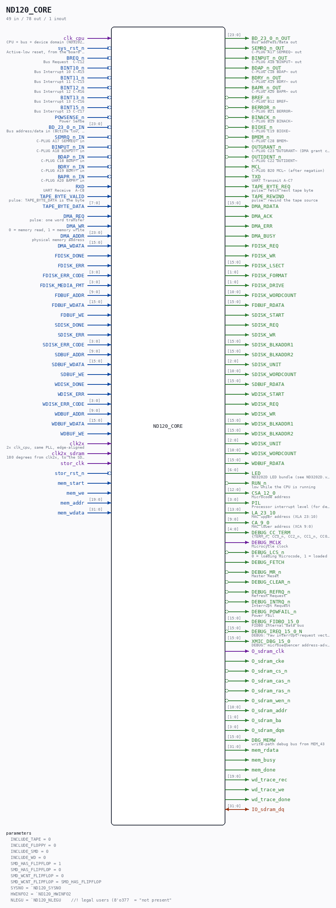

# ND120_CORE

**ND120 board-independent core (ND3202D + ND-BUS device chain)**

Source: `/mnt/e/Dev/Repos/Ronny/nd-120/Verilog/ND120_CORE.v`
  ·  Author: Ronny Hansen

> Generated by `Verilog/tests/module_doc.py` from the `//!`
> comments in the source. Do not edit by hand - edit the RTL comments and regenerate.

## Description

ND120 BOARD-INDEPENDENT CORE
ND3202D CPU board + the optional ND-BUS Verilog device chain.
Contains NO board-specific logic: no PLL/MMCM, no power-on reset, no
LED mapping, no 7-segment, no SDRAM primitive, no heartbeat counter.
Every board (Basys3/sim ND120_TOP, Tang Nano 20K, future boards)
instantiates this and supplies its own clock, reset and I/O.
Behaviour-preserving extraction of ND120_TOP.v (14-JUL-2026):
the device chain and the ND3202D instance are moved verbatim; the
`ifdef ND120_VERILOG_DEVICES gate becomes the INCLUDE_* parameters.
Clocking: clk_cpu is the ONE net that fed ND3202D.sysclk, CLOCK_1,
CLOCK_2 and the device chain's s_dev_clk in BOTH the sim and the FPGA
branch of ND120_TOP, so it collapses to a single core input. The
board decides what drives it (sim: sysclk; Basys3: clk_cpu from the
MMCM; Tang: clk_cpu from the rPLL).
Storage seam: the core exposes the byte/disk SOURCE ports and knows
nothing of SD-FAT or of the C harness. The board supplies the
implementation (sim: forwarded to ND120_TOP ports, served by the C
model; hardware: nd_storage / nd_storage_devices).
Ronny Hansen

## Parameters

| Parameter | Default |
|---|---|
| `INCLUDE_TAPE` | `0` |
| `INCLUDE_FLOPPY` | `0` |
| `INCLUDE_SMD` | `0` |
| `INCLUDE_WD` | `0` |
| `SMD_HAS_FLIPFLOP` | `1` |
| `SMD_HAS_FLIPFLOP` | `0` |
| `SMD_WCNT_FLIPFLOP` | `0` |
| `SMD_WCNT_FLIPFLOP` | `SMD_HAS_FLIPFLOP` |
| `SYSNO` | ``ND120_SYSNO` |
| `HWINFO2` | ``ND120_HWINFO2` |
| `NLEGU` | ``ND120_NLEGU    //! legal users (8'o377  = "not present"` |

## Ports

| Direction | Width | Name | Description |
|---|---|---|---|
| input | `1` | `clk_cpu` | CPU + bus + device domain (ND3202D sysclk/CLOCK_1/CLOCK_2) |
| input | `1` | `sys_rst_n` *(active low)* | Active-low reset, from the board's power-on reset |
| input | `1` | `BREQ_n` *(active low)* | Bus Request  C-C12 |
| input | `1` | `BINT10_n` *(active low)* | Bus Interrupt 10 C-A15 |
| input | `1` | `BINT11_n` *(active low)* | Bus Interrupt 11 C-C15 |
| input | `1` | `BINT12_n` *(active low)* | Bus Interrupt 12 C-A16 |
| input | `1` | `BINT13_n` *(active low)* | Bus Interrupt 13 C-C16 |
| input | `1` | `BINT15_n` *(active low)* | Bus Interrupt 15 C-C17 |
| input | `1` | `POWSENSE_n` *(active low)* | Power Sense |
| input | `[23:0]` | `BD_23_0_n_IN` | Bus address/data in (active low, pulled high) |
| output | `[23:0]` | `BD_23_0_n_OUT` | Bus address/data out |
| input | `1` | `SEMRQ_n_IN` | C-PLUG A17 SEMREQ~ in |
| output | `1` | `SEMRQ_n_OUT` | C-PLUG A17 SEMREQ~ out |
| input | `1` | `BINPUT_n_IN` | C-PLUG A18 BINPUT~ in |
| output | `1` | `BINPUT_n_OUT` | C-PLUG A18 BINPUT~ out |
| input | `1` | `BDAP_n_IN` | C-PLUG C18 BDAP~ in |
| output | `1` | `BDAP_n_OUT` | C-PLUG C18 BDAP~ out |
| input | `1` | `BDRY_n_IN` | C-PLUG A19 BDRY~ in |
| output | `1` | `BDRY_n_OUT` | C-PLUG A19 BDRY~ out |
| input | `1` | `BAPR_n_IN` | C-PLUG A20 BAPR~ in |
| output | `1` | `BAPR_n_OUT` | C-PLUG A20 BAPR~ out |
| output | `1` | `BREF_n` *(active low)* | C-PLUG B12 BREF~ |
| output | `1` | `BERROR_n` *(active low)* | C-PLUG B21 BERROR~ |
| output | `1` | `BINACK_n` *(active low)* | C-PLUG B19 BINACK~ |
| output | `1` | `BIOXE_n` *(active low)* | C-PLUG C19 BIOXE~ |
| output | `1` | `BMEM_n` *(active low)* | C-PLUG C28 BMEM~ |
| output | `1` | `OUTGRANT_n` *(active low)* | C-PLUG C23 OUTGRANT~ (DMA grant chain head) |
| output | `1` | `OUTIDENT_n` *(active low)* | C-PLUG C22 OUTIDENT~ |
| output | `1` | `MCL` | C-PLUG B20 MCL~ (after negation) |
| input | `1` | `RXD` | UART Receive  A-C8 |
| output | `1` | `TXD` | UART Transmit A-C7 |
| output | `1` | `TAPE_BYTE_REQ` | pulse: fetch next tape byte |
| input | `1` | `TAPE_BYTE_VALID` | pulse: TAPE_BYTE_DATA is the byte |
| input | `[7:0]` | `TAPE_BYTE_DATA` |  |
| output | `1` | `TAPE_REWIND` | pulse: rewind the tape source |
| input | `1` | `DMA_REQ` | pulse: one word transfer |
| input | `1` | `DMA_WR` | 0 = memory read, 1 = memory write |
| input | `[23:0]` | `DMA_ADDR` | physical memory address |
| input | `[15:0]` | `DMA_WDATA` |  |
| output | `[15:0]` | `DMA_RDATA` |  |
| output | `1` | `DMA_ACK` |  |
| output | `1` | `DMA_ERR` |  |
| output | `1` | `DMA_BUSY` |  |
| output | `1` | `FDISK_REQ` |  |
| output | `1` | `FDISK_WR` |  |
| output | `[15:0]` | `FDISK_LSECT` |  |
| output | `[1:0]` | `FDISK_FORMAT` |  |
| output | `[1:0]` | `FDISK_DRIVE` |  |
| output | `[10:0]` | `FDISK_WORDCOUNT` |  |
| input | `1` | `FDISK_DONE` |  |
| input | `1` | `FDISK_ERR` |  |
| input | `[3:0]` | `FDISK_ERR_CODE` |  |
| input | `[3:0]` | `FDISK_MEDIA_FMT` |  |
| input | `[9:0]` | `FDBUF_ADDR` |  |
| input | `[15:0]` | `FDBUF_WDATA` |  |
| input | `1` | `FDBUF_WE` |  |
| output | `[15:0]` | `FDBUF_RDATA` |  |
| output | `1` | `SDISK_START` |  |
| output | `1` | `SDISK_REQ` |  |
| output | `1` | `SDISK_WR` |  |
| output | `[15:0]` | `SDISK_BLKADDR1` |  |
| output | `[15:0]` | `SDISK_BLKADDR2` |  |
| output | `[2:0]` | `SDISK_UNIT` |  |
| output | `[10:0]` | `SDISK_WORDCOUNT` |  |
| input | `1` | `SDISK_DONE` |  |
| input | `1` | `SDISK_ERR` |  |
| input | `[3:0]` | `SDISK_ERR_CODE` |  |
| input | `[9:0]` | `SDBUF_ADDR` |  |
| input | `[15:0]` | `SDBUF_WDATA` |  |
| input | `1` | `SDBUF_WE` |  |
| output | `[15:0]` | `SDBUF_RDATA` |  |
| output | `1` | `WDISK_START` |  |
| output | `1` | `WDISK_REQ` |  |
| output | `1` | `WDISK_WR` |  |
| output | `[15:0]` | `WDISK_BLKADDR1` |  |
| output | `[15:0]` | `WDISK_BLKADDR2` |  |
| output | `[2:0]` | `WDISK_UNIT` |  |
| output | `[10:0]` | `WDISK_WORDCOUNT` |  |
| input | `1` | `WDISK_DONE` |  |
| input | `1` | `WDISK_ERR` |  |
| input | `[3:0]` | `WDISK_ERR_CODE` |  |
| input | `[9:0]` | `WDBUF_ADDR` |  |
| input | `[15:0]` | `WDBUF_WDATA` |  |
| input | `1` | `WDBUF_WE` |  |
| output | `[15:0]` | `WDBUF_RDATA` |  |
| output | `[6:0]` | `LED` | ND3202D LED bundle (see ND3202D.v port comment) |
| output | `1` | `RUN_n` *(active low)* | low while the CPU is running |
| output | `[12:0]` | `CSA_12_0` | Microcode address |
| output | `[3:0]` | `PIL` | Processor interrupt level (for debug capture) |
| output | `[13:0]` | `LA_23_10` | MAC upper address (XLA 23:10) |
| output | `[9:0]` | `CA_9_0` | MAC lower address (XCA 9:0) |
| output | `[4:0]` | `DEBUG_CC_TERM` | {TERM_n, CC3_n, CC2_n, CC1_n, CC0_n} |
| output | `1` | `DEBUG_MCLK` | Microcycle clock |
| output | `1` | `DEBUG_LCS_n` *(active low)* | 0 = loading microcode, 1 = loaded |
| output | `1` | `DEBUG_FETCH` |  |
| output | `1` | `DEBUG_MR_n` *(active low)* | Master Reset |
| output | `1` | `DEBUG_CLEAR_n` *(active low)* |  |
| output | `1` | `DEBUG_REFRQ_n` *(active low)* | Refresh Request |
| output | `1` | `DEBUG_INTRQ_n` *(active low)* | Interrupt Request |
| output | `1` | `DEBUG_POWFAIL_n` *(active low)* | Power Fail |
| output | `[15:0]` | `DEBUG_FIDBO_15_0` | FIDBO internal data bus |
| output | `[15:0]` | `DEBUG_IREQ_15_0_N` *(active low)* | DEBUG: raw interrupt-request vector (active low) |
| output | `[15:0]` | `XMIC_DBG_15_0` | DEBUG: microsequencer address-advance probe (Tang 06000-hang) |
| input | `1` | `clk2x` | 2x clk_cpu, same PLL, edge-aligned |
| input | `1` | `clk2x_sdram` | 180 degrees from clk2x, to the SDRAM chip |
| output | `1` | `O_sdram_clk` |  |
| output | `1` | `O_sdram_cke` |  |
| output | `1` | `O_sdram_cs_n` *(active low)* |  |
| output | `1` | `O_sdram_cas_n` *(active low)* |  |
| output | `1` | `O_sdram_ras_n` *(active low)* |  |
| output | `1` | `O_sdram_wen_n` *(active low)* |  |
| inout | `[31:0]` | `IO_sdram_dq` |  |
| output | `[10:0]` | `O_sdram_addr` |  |
| output | `[1:0]` | `O_sdram_ba` |  |
| output | `[3:0]` | `O_sdram_dqm` |  |
| output | `[15:0]` | `DBG_MEMW` | write-path debug bus from MEM_43 |
| input | `1` | `stor_clk` |  |
| input | `1` | `stor_rst_n` *(active low)* |  |
| input | `1` | `mem_start` |  |
| input | `1` | `mem_we` |  |
| input | `[19:0]` | `mem_addr` |  |
| input | `[31:0]` | `mem_wdata` |  |
| output | `[31:0]` | `mem_rdata` |  |
| output | `1` | `mem_busy` |  |
| output | `1` | `mem_done` |  |
| output | `[19:0]` | `wd_trace_rec` |  |
| output | `1` | `wd_trace_we` |  |
| output | `1` | `wd_trace_done` |  |
