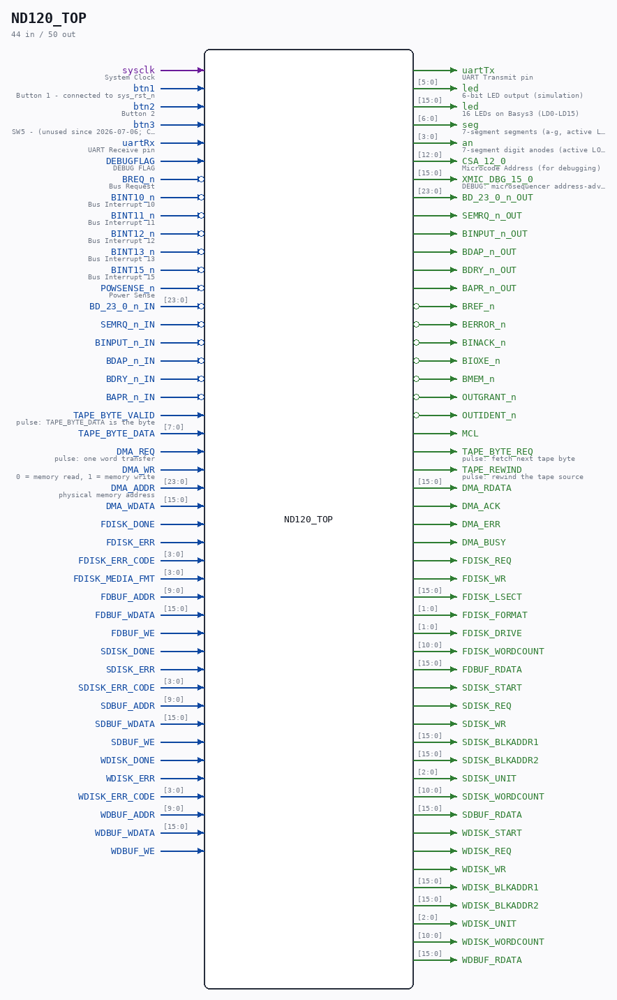

# ND120_TOP

**ND120 CPU, MEMORY MANAGEMENT and MEMORY.**

Source: `/mnt/e/Dev/Repos/Ronny/nd-120/Verilog/ND120_TOP.v`
  ·  Author: Ronny Hansen

> Generated by `Verilog/tests/module_doc.py` from the `//!`
> comments in the source. Do not edit by hand - edit the RTL comments and regenerate.

## Ports

| Direction | Width | Name | Description |
|---|---|---|---|
| input | `1` | `sysclk` | System Clock |
| input | `1` | `btn1` | Button 1 - connected to sys_rst_n |
| input | `1` | `btn2` | Button 2 |
| input | `1` | `btn3` | SW5 - (unused since 2026-07-06; CPU now fixed at clk_cpu ~16.67MHz) |
| input | `1` | `uartRx` | UART Receive pin |
| output | `1` | `uartTx` | UART Transmit pin |
| output | `[5:0]` | `led` | 6-bit LED output (simulation) |
| output | `[15:0]` | `led` | 16 LEDs on Basys3 (LD0-LD15) |
| output | `[6:0]` | `seg` | 7-segment segments (a-g, active LOW) |
| output | `[3:0]` | `an` | 7-segment digit anodes (active LOW) |
| input | `1` | `DEBUGFLAG` | DEBUG FLAG |
| output | `[12:0]` | `CSA_12_0` | Microcode Address (for debugging) |
| output | `[15:0]` | `XMIC_DBG_15_0` | DEBUG: microsequencer address-advance probe (matches Tang capture: {SC6,s_mclk_n,MCLK_EN,regIW[12:0]}) |
| input | `1` | `BREQ_n` *(active low)* | Bus Request |
| input | `1` | `BINT10_n` *(active low)* | Bus Interrupt 10 |
| input | `1` | `BINT11_n` *(active low)* | Bus Interrupt 11 |
| input | `1` | `BINT12_n` *(active low)* | Bus Interrupt 12 |
| input | `1` | `BINT13_n` *(active low)* | Bus Interrupt 13 |
| input | `1` | `BINT15_n` *(active low)* | Bus Interrupt 15 |
| input | `1` | `POWSENSE_n` *(active low)* | Power Sense |
| input | `[23:0]` | `BD_23_0_n_IN` |  |
| output | `[23:0]` | `BD_23_0_n_OUT` |  |
| input | `1` | `SEMRQ_n_IN` |  |
| output | `1` | `SEMRQ_n_OUT` |  |
| input | `1` | `BINPUT_n_IN` |  |
| output | `1` | `BINPUT_n_OUT` |  |
| input | `1` | `BDAP_n_IN` |  |
| output | `1` | `BDAP_n_OUT` |  |
| input | `1` | `BDRY_n_IN` |  |
| output | `1` | `BDRY_n_OUT` |  |
| input | `1` | `BAPR_n_IN` |  |
| output | `1` | `BAPR_n_OUT` |  |
| output | `1` | `BREF_n` *(active low)* |  |
| output | `1` | `BERROR_n` *(active low)* |  |
| output | `1` | `BINACK_n` *(active low)* |  |
| output | `1` | `BIOXE_n` *(active low)* |  |
| output | `1` | `BMEM_n` *(active low)* |  |
| output | `1` | `OUTGRANT_n` *(active low)* |  |
| output | `1` | `OUTIDENT_n` *(active low)* |  |
| output | `1` | `MCL` |  |
| output | `1` | `TAPE_BYTE_REQ` | pulse: fetch next tape byte |
| input | `1` | `TAPE_BYTE_VALID` | pulse: TAPE_BYTE_DATA is the byte |
| input | `[7:0]` | `TAPE_BYTE_DATA` |  |
| output | `1` | `TAPE_REWIND` | pulse: rewind the tape source |
| input | `1` | `DMA_REQ` | pulse: one word transfer |
| input | `1` | `DMA_WR` | 0 = memory read, 1 = memory write |
| input | `[23:0]` | `DMA_ADDR` | physical memory address |
| input | `[15:0]` | `DMA_WDATA` |  |
| output | `[15:0]` | `DMA_RDATA` |  |
| output | `1` | `DMA_ACK` |  |
| output | `1` | `DMA_ERR` |  |
| output | `1` | `DMA_BUSY` |  |
| output | `1` | `FDISK_REQ` |  |
| output | `1` | `FDISK_WR` |  |
| output | `[15:0]` | `FDISK_LSECT` |  |
| output | `[1:0]` | `FDISK_FORMAT` |  |
| output | `[1:0]` | `FDISK_DRIVE` |  |
| output | `[10:0]` | `FDISK_WORDCOUNT` |  |
| input | `1` | `FDISK_DONE` |  |
| input | `1` | `FDISK_ERR` |  |
| input | `[3:0]` | `FDISK_ERR_CODE` |  |
| input | `[3:0]` | `FDISK_MEDIA_FMT` |  |
| input | `[9:0]` | `FDBUF_ADDR` |  |
| input | `[15:0]` | `FDBUF_WDATA` |  |
| input | `1` | `FDBUF_WE` |  |
| output | `[15:0]` | `FDBUF_RDATA` |  |
| output | `1` | `SDISK_START` |  |
| output | `1` | `SDISK_REQ` |  |
| output | `1` | `SDISK_WR` |  |
| output | `[15:0]` | `SDISK_BLKADDR1` |  |
| output | `[15:0]` | `SDISK_BLKADDR2` |  |
| output | `[2:0]` | `SDISK_UNIT` |  |
| output | `[10:0]` | `SDISK_WORDCOUNT` |  |
| input | `1` | `SDISK_DONE` |  |
| input | `1` | `SDISK_ERR` |  |
| input | `[3:0]` | `SDISK_ERR_CODE` |  |
| input | `[9:0]` | `SDBUF_ADDR` |  |
| input | `[15:0]` | `SDBUF_WDATA` |  |
| input | `1` | `SDBUF_WE` |  |
| output | `[15:0]` | `SDBUF_RDATA` |  |
| output | `1` | `WDISK_START` |  |
| output | `1` | `WDISK_REQ` |  |
| output | `1` | `WDISK_WR` |  |
| output | `[15:0]` | `WDISK_BLKADDR1` |  |
| output | `[15:0]` | `WDISK_BLKADDR2` |  |
| output | `[2:0]` | `WDISK_UNIT` |  |
| output | `[10:0]` | `WDISK_WORDCOUNT` |  |
| input | `1` | `WDISK_DONE` |  |
| input | `1` | `WDISK_ERR` |  |
| input | `[3:0]` | `WDISK_ERR_CODE` |  |
| input | `[9:0]` | `WDBUF_ADDR` |  |
| input | `[15:0]` | `WDBUF_WDATA` |  |
| input | `1` | `WDBUF_WE` |  |
| output | `[15:0]` | `WDBUF_RDATA` |  |
