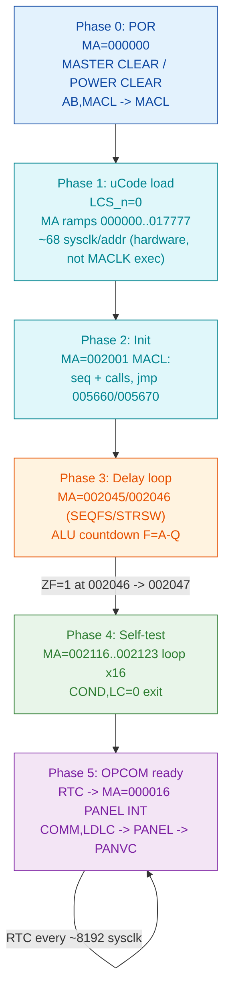

# ND-120 Boot Golden Spec — Microcode Execution Reference

**Full path:** `Verilog/docs/boot-golden-spec.md`
**Last updated:** 2026-07-03

Ground-truth description of the ND-120 microcode boot flow: what address the
CPU executes, in what order, and the per-phase assertions that let tooling
**detect when the boot does NOT do what it should**. Built by cross-checking
three sources that agree:

1. **Observed trace** — `MA/CSA` path from microcode address 0, extracted from
   the Verilator run (`sim/trace_latch.csv`, `sim/waveform.fst`).
2. **ND-120 microcode listing** (OCR) — `Code/Microcode/ND-120 Mikroprogramlisting-L-ocr.md`.
3. **ND-110 microcode source** (clean, ROM-validated) —
   `$ND_REPOS/ND110Compile/ND110Compile/uCode/ND-110-RASK.uc`.
   Same label names as ND-120; use it to decode OCR ambiguities. NOTE: ND-110 is
   *similar in principle, not identical* to ND-120 — trust the trace + ND-120
   listing for exact addresses, use ND-110 for semantics/labels.

---

## 0. The execution model (READ FIRST)

- The microcode address the CPU is executing is **`MA_12_0[12:0]`**, produced in
  `CGA_MIC` (`DELILAH-CPU/CGA_MIC/circuit/CGA_MIC.v`, port line 63).
- **A microinstruction is committed on the `MACLK` rising edge (0 -> 1).** To get
  one record per executed microinstruction, **sample `MA_12_0` at `posedge MACLK`**
  — NOT every sysclk (that oversamples ~68x).
- `CSA_12_0` at board level is the same address: `SignalReport.md:178` —
  `XMA_12_0 from CGA <= MA_12_0 from CGA.MIC`. So `MA` (inside CGA) and `CSA`
  (board) are the same value; sample whichever is convenient at `posedge MACLK`.
- Address generation path (`mic-calculation.md`):
  `MASEL (jmp/ret/next/repeat) -> W[12:0] -> IPOS mux -> MA[12:0]`. The `IPOS`
  mux can overlay an opcode dispatch (`CD[15:6]`), a control-store write (`WCA`),
  or a **trap vector** (`TVEC[3:0]`), selected by `TRAPN`/`MAPN`/`EWCAN`.
- Only genuinely async steer during a clean boot is the **RTC interrupt** ->
  trap vector -> microcode **octal 16** (see Phase 5). Everything else is
  deterministic.

Golden trace = the sequence of `(MA_12_0 @ posedge MACLK)` values, plus the
branch-condition context at each step.

---

## 1. Boot phase flow

---

## 2. Phase-by-phase reference (observed addresses, octal)

All addresses verified against the Verilator trace from address 0. Ticks are
`sim/trace_latch.csv` cycle numbers (sysclk samples) for orientation only.

### Phase 0 — Power-on / Master Clear
- `MA=000000` = `MACL:` (MASTER CLEAR / POWER CLEAR). Trap vector 0.
- ND-110 ref: `ND-110-RASK.uc:15` (`0/  % MASTER CLEAR / POWER CLEAR  AB,MACL ... MACL;`).
- Entered on reset deassert (`test_nd120.cpp:188`, `btn1=true` at cnt=100).

### Phase 1 — Microcode (WCS) load
- `LCS_n=0`. `MA/CSA` counts **sequentially 000000 -> 017777** (all 8192 words),
  ~68 sysclk per address. This is the hardware load state machine
  (`MR_n -> LCS_n`, `CYC_36`/`PAL_44403C`), **not** MACLK-driven execution.
- After 017777 it wraps to 000000 and `LCS_n -> 1`.
- Observed: ramp begins ~cycle 16,415; wrap at ~cycle 573,403. (`boot-sequence.md`.)

### Phase 2 — Initialization
- First executed address after load: **`MA=002001`** (`MACL:`).
- Observed path (trace, collapsed): `002001 -> ...seq... -> 002017`,
  jmp `005660 -> 005670 -> 002020`, then CALLs `001006`, `001020`, `003707`,
  `001021`, `001163-001165`, `001022-001027`, `001112-001116`, `002173-002201`,
  falling through `002042 -> 002044`.
- This is CPU + MOPC (operator comms) variable init.

### Phase 3 — Delay loop (ALU countdown)  [CURRENT FPGA FAILURE POINT]
- `MA=002045 / 002046` (labels `SEQFS` / `STRSW`). ALU countdown: `Q` preloaded
  (e.g. 0x3FFF), each iteration `F = A - Q`; loop while `ZF=0`.
- Reusable subroutine, called 3x during boot (136 / 6 / ~180,213 iters). The big
  3rd call is the ~0.5-1 s power-up delay.
- **SHOULD:** at `002046`, when `ZF=1` (F reached 0), branch to **`002047`**.
- **FPGA BUG:** stuck oscillating `002045/002046` (hex 0x0425/0x0426), never
  reaches `002047` (0x0427). This is the divergence the whole effort targets.

### Phase 4 — CPU self-test
- Exit `002047 -> 003710` (util) `-> 001035-001037 -> 002050 ... 002115` (setup)
  `-> 002116-002123` **self-test loop**.
- Self-test loop `002116-002123`: iterates ~16 times; `COND,LC=0` at `002123`
  exits when the loop counter reaches 0. (`002116` area in ND-120 listing
  lines 6560-6610; error path `STERR1` at `002121`.)
- This loop is self-test TEST 6 (loop counter / shift-right-double via GPR),
  a pure CPU-core test. It does NOT touch memory parity - the `IDBS,PEA`
  select in the `002123` loop-back word is a don't-care (`ALUD,NONE`); no
  self-test subtest exercises memory parity at all. Full evidence:
  `docs/nd120-parity-analysis.md`.
- Then UART output routines run (self-test result banner).

### Phase 5 — OPCOM ready + RTC async
- CPU reaches OPCOM (operator communication) ready and waits for a UART command.
- **RTC interrupt** now fires periodically -> trap vector -> **`MA=000016`**
  = PANEL INTERRUPT: `IDBS,PANEL COMM,LDLC T,JMP -> PANEL -> PANVC`
  (`ND-110-RASK.uc:90` `16/`, and lines 234-250). The `COMM,LDLC` (load loop
  counter) at o16 is the subject of `LDLCN_o000016_investigation.md`.
- Observed RTC/PANVC dispatches begin ~cycle 755,233 in the trace.

---

## 3. Detection rule — "did it do what it should?"

Reduce a run (sim or FPGA) to `MA @ posedge MACLK` and check against the phases
above. Classify every divergence:

- **STRUCTURAL divergence = BUG** — same `(MA, branch condition)` yields a
  different next `MA` than the golden spec. Detection examples:
  - Phase 2: first post-load `MA != 002001`, or the `002017 -> 005660 -> 005670
    -> 002020` jump chain is wrong -> IPOS/MASEL address selection broken.
  - **Phase 3: `MA` stays in {002045, 002046} beyond the max expected iteration
    count and never reaches `002047`** -> the current FPGA stall. Concretely: at
    `002046` with `ZF=1`, observed next `MA=002045` instead of `002047`.
  - Phase 4: self-test loop `002116-002123` does not exit after LC reaches 0.
- **BENIGN divergence = IGNORE** — different delay-loop iteration counts,
  different RTC dispatch timing/count, different absolute ticks. These follow
  from clock/RTC phase, not from logic errors.

Minimum signals to log per step for this rule: `MA_12_0`, `MACLK` (edge),
`LCS_n`, `ZF` (or `COND`), `TVEC_3_0`, `TRAPN`, and an RTC-active flag.

---

## 4. How to capture the golden trace (sim)

The harness (`sim/test_nd120.cpp`) already reads `top->CSA_12_0` every tick and
already event-logs the delay-loop exit (`:204-209`). To produce the per-step
golden trace, add a hook that, **on `posedge MACLK`**, appends
`{tick, MA, ZF, TVEC, TRAPN, rtc}` to `boot_trace.json`. Expose `MACLK`, `ZF`,
`TVEC`, `TRAPN`, RTC as top-level `s_debug_*` signals (some already are), or read
them via `rootp` as `latch_ff_compare.cpp` does.

Then the FPGA ILA capture (same signals, `s_debug_csa` = `MA`) reduces to the
same form, and `compare_boot_trace.py` applies the Section 3 rule.

---

## 5. Source references

- `Verilog/mic-calculation.md` — `MA_12_0` generation (MASEL/W/IPOS).
- `Verilog/cycle_clock.md` — `MACLK_n`/`MCLK_n` cycle-state timing.
- `Verilog/sim/boot_analysis.md` — boot timeline Phases 1-5.
- `Verilog/boot-sequence.md` — PROM -> WCS microcode load.
- `Verilog/DELILAH-CPU/CGA_MIC/LDLCN_o000016_investigation.md` — o16 PANVC/RTC path.
- `Verilog/SignalReport.md` — signal cross-ref (`CSA_12_0 = MA_12_0`).
- `Code/Microcode/ND-120 Mikroprogramlisting-L-ocr.md` — ND-120 listing (addresses).
- `$ND_REPOS/ND110Compile/ND110Compile/uCode/ND-110-RASK.uc` — clean ND-110 source (label/semantic decode).
- `Verilog/FPGA-BRINGUP-PLAN.md` — overall phase plan (sections 11-12: golden model + capture automation).
