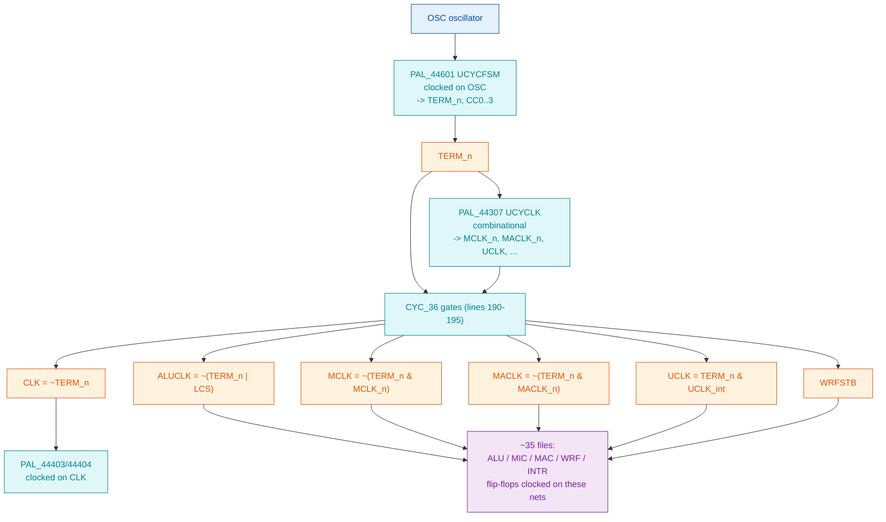

# Clock-Enable Refactor: eliminating the derived-clock nets

**Full path:** `/mnt/e/Dev/Repos/Ronny/nd-120/Verilog/docs/clock-enable-refactor.md`
**Last updated:** 2026-07-04
**Status:** SPEC FOR REVIEW - no code changed yet.

## Why

Both FPGAs fail timing (Basys3 routed **WNS approx -38.7 ns**, TNS approx
-18,000 ns; earlier synth estimate -100 ns) and the OSS/Gowin flow rejects the
TTL primitives outright. Same root cause: the CPU manufactures its clocks with
combinational gates and fans them out as **clock nets**. The 2026-07-04 Vivado
run confirmed it by force-inserting global buffers on exactly these nets:

```
Opt 31-194: Inserted BUFG ... ALUCLK_BUFG ... MCLK_BUFG ... TERM_reg_BUFG ... A239/result_BUFG
Place 30-568: A LUT '.../UCLK_INST_0' is driving clock pin of 10 registers
Place 30-568: A LUT '.../PAL_44803_URAMA/sdram_reg_i_1__0' is driving clock pin of 4 registers
```

STA cannot constrain dozens of gated/derived clock domains -> massive negative
setup AND hold slack -> logic never settles -> boot fails on hardware. This is a
**timing** fix, distinct from the latch->FF functional work (FF sim already boots
identically to latch sim). It is **board-independent** - the Tang will not fix it.

## The clock tree today (from `CPU-BOARD-3202/circuit/CYC_36.v`)

Every CPU "clock" is minted in one place - `CYC_36` - from `OSC` and `TERM_n`:



`CYC_36.v:190-195` is the literal source of the derived clocks:

```verilog
assign s_clk       = ~s_term_n;                 // CLK
assign s_aluclk    = ~(s_term_n | s_lcs);       // ALUCLK
assign s_mclk      = ~(s_term_n & s_mclk_n);    // MCLK
assign s_maclk_out = ~(s_term_n & s_maclk_n);   // MACLK
assign s_uclk_out  =  (s_term_n & s_uclk);      // UCLK
```

## Target architecture: one `sysclk` domain, derived clocks become enables

`CYC_36` becomes a **clock-enable generator**. Run the cycle FSM
(`PAL_44601`, and the `44307/44403/44404` chain) on `sysclk`, and emit
one-`sysclk`-wide **enable** signals in place of the gated clock nets:

| Old clock net | New enable | Consumers change to |
|---------------|-----------|---------------------|
| `MCLK`   | `mclk_en`   | `always @(posedge sysclk) if (mclk_en)   q<=d;` |
| `MACLK`  | `maclk_en`  | `... if (maclk_en) ...`  |
| `ALUCLK` | `aluclk_en` | `... if (aluclk_en) ...` |
| `UCLK`   | `uclk_en`   | `... if (uclk_en) ...`   |
| `CLK`    | `clk_en`    | `... if (clk_en) ...`    |
| `WRFSTB` | `wrfstb_en` | `... if (wrfstb_en) ...` |

One clock domain -> STA constrains cleanly -> timing closes (the ND-120 is slow;
one modest sysclk has ample margin). It also unblocks the OSS/Gowin flow, which
rejects the multi-edge TTL primitives.

**All new behavior is gated under `FPGA_FF_MODE`.** The Verilator latch path
(default, `USE_LATCHES=1`) stays byte-for-byte as-is; only the FF/FPGA build sees
the enable clocking. The `make compare` golden reference is therefore unchanged.

## The two idioms, and WHEN to use each (this is the load-bearing decision)

`Shared/ndlib/LATCH.v` is **already converted** and its header records the trap:

> Edge-detect was tried first and broke LCS loading, because during LCS load
> `s_aluclk_n` is held high constantly - no rising edge ever appears, so an
> edge-detect FF never fires and CSEL_Q stayed at its init value.

So there are two patterns, and picking wrong silently breaks boot:

**A. Level-capture (the LATCH pattern) - the SAFE DEFAULT.**
```verilog
always @(posedge sysclk) if (enable_level) q <= d;   // tracks d while enable high
```
Use when the "clock"/enable can be **held static** across a whole phase (the LCS
load holds ALUCLK's source static). Matches `L4.v`/`L8.v`/`LATCH.v` already in the
tree. Transparent on a 1-sysclk grain - the closest synchronous analog of the
original 74xx transparent latch.

**B. Edge-enable (one-shot) - only where a true single pulse per cycle is needed.**
```verilog
reg d1; always @(posedge sysclk) d1 <= raw;
wire en = raw & ~d1;                                 // 1-sysclk pulse on rising edge
always @(posedge sysclk) if (en) q <= d;
```
Use for genuine edge-triggered registers whose source **pulses** every cycle
(MCLK/MACLK/UCLK per bus cycle). NEVER use where the source can sit static - that
is the exact failure LATCH hit.

**RESOLVED RULE (2026-07-04 investigation).** The level-vs-edge choice is decided
by the primitive's *type*, not per-instance guesswork:

- **Transparent latches** (`LATCH`, `L4`, `L8`) are level-sensitive - they must
  track D across the whole enable-high window -> **pattern A (level-capture)**.
  Already converted. The LCS trap only ever applied to these.
- **Edge flip-flops** (`D_FLIPFLOP`, `J_K_FLIPFLOP`, `T_FLIPFLOP`, `R81`, `R41P`,
  `R81P`, `SCAN_FF`) trigger on `posedge <clock>` -> **pattern B (edge-detect)**.
  There is NO LCS trap for them: a real edge FF clocked on a static-held signal
  *also* never fires, so edge-detect (`raw & ~raw_d`) is the exact equivalent.

So the FF-primitive conversion is uniform - edge-detect for all of them - and
`make compare` (only-BDRY gate) confirms each one. This removes the biggest
correctness risk the earlier draft flagged.

## Verified baseline = the acceptance gate (2026-07-04)

On the checkpoint tree, `make compare` in `sim/` gives:
- FF sim **boots**: CSA reaches `o002001 @ cycle 69778` and `o002047 @ 72362`
  (max CSA `o17777` = WCS load top).
- The **only** diverging signal is **BDRY** (5872 / 1,000,000 rows, from cycle 0)
  - the documented harmless init transient.

So the gate for every conversion step is: `make compare` must still show
**only BDRY differing** AND FF must still hit `o002001@69778` / `o002047@72362`.
`make compare` prints "DIVERGENCE FOUND" even for the BDRY-only case (it is a raw
diff) - so check the *columns* that differ, not just the banner. Any NEW diverging
column (or a missed boot milestone) means the conversion is wrong -> revert it.

Verify boot milestones after a run:
```bash
awk -F, 'NR>2 && $2==1025{print "o002001@"$1;exit}' trace_ff.csv   # expect 69778
awk -F, 'NR>2 && $2==1063{print "o002047@"$1;exit}' trace_ff.csv   # expect 72362
```

## Plumbing reality (measured)

Under `FPGA_FF_MODE` the primitive uses `sysclk`, so `sysclk` MUST be connected at
every instance - you cannot half-plumb (an unconnected input = 0 = dead clock ->
FF build breaks / never boots). Each FF primitive therefore drags `sysclk`
threading through its hierarchy. Measured parent coverage (files instantiating the
primitive that still lack a `sysclk` port):

| Primitive | instances | parent files | missing sysclk |
|-----------|-----------|--------------|----------------|
| `SCAN_FF` | 111 | 11 | 9 |
| `D_FLIPFLOP` | 77 | ~14 | ~9 |
| `R81` | 17 | 10 | 6 |
| `R41P` | 6 | 4 | 3 |
| `J_K_FLIPFLOP` | 6 | 3 | 2 |

Pattern for adding the port: **always declare `input sysclk`** (both build modes),
wrap it `/* verilator lint_off UNUSEDSIGNAL */ ... lint_on */` since it is unused
in the latch build, and connect `.sysclk(sysclk)` at every instance. Parents that
merely pass it on need no waiver (a signal wired to a child port counts as used).
NOTE: the module-level iverilog testbenches under `*/sim/*_tb.v` also instantiate
these primitives and will need `.sysclk` added too - but they are outside the
`make compare` gate, so update them per-primitive when convenient.

## Per-primitive transform

Convert the **base primitives first** - the PALs and TTL parts instantiate these,
so ~7 edits fix the majority centrally. Add a `sysclk` port; treat the existing
clock port as the enable; keep the old edge semantics.

### `Shared/logisim/D_FLIPFLOP.v`  (the big one - most FFs are these)
Today (`clock` receives ALUCLK/MCLK/... as a real clock):
```verilog
assign s_clock = (InvertClockEnable == 0) ? clock : ~clock;
always @(posedge s_clock) s_currentState <= d;          // gen_sync
always @(posedge s_clock or posedge preset or posedge reset) ...  // gen_async
```
Target (FPGA_FF_MODE): sample `clock` on sysclk, edge-detect *with the original
polarity*, clock on sysclk. `InvertClockEnable==1` means the original active edge
is the **falling** edge of `clock` (posedge of `~clock`) - the enable must fire on
that same edge, else data captures a phase early/late.
```verilog
`ifdef FPGA_FF_MODE
  reg clk_d;
  always @(posedge sysclk) clk_d <= s_clock;            // s_clock already polarity-adjusted
  wire tick = s_clock & ~clk_d;                          // rising edge of s_clock
  // async preset/reset: keep them async (they are POR-class), gate d-capture on tick
  ...
`else
  ... existing latch/FF body unchanged ...
`endif
```
Open point (call out for review): async preset/reset (`ACTIVE_ASYNC==1`) - keep
truly async (POR/reset class), or also synchronize to sysclk? Leaning: keep async
(they mirror the hardware master-clear and only fire at reset).

### `Shared/ndlib/LATCH.v`, `L4.v`, `L8.v`  - ALREADY DONE (pattern A). Use as reference.

### `Shared/ndlib/R81.v`, `R41P.v`, `R81P.v`, `SCAN_FF.v`
Same as D_FLIPFLOP: add `sysclk`, old clock -> enable. These are register banks;
most are per-cycle strobed (pattern B) but VERIFY each source against the
static-hold rule before choosing B over A.

### `Shared/logisim/T_FLIPFLOP.v`, `J_K_FLIPFLOP.v`
Multi-edge (clock + async pre/clr) - the exact ones yosys rejects. Same transform;
these gate the OSS/Gowin flow, so they must be done for Tang regardless.

## CYC_36 enable-generator

1. **Reduce OSC to a sysclk tick.** `PAL_44601` clocks on `OSC` today. Either (a)
   drive the FSM on sysclk with an `osc_tick` enable (edge-detect OSC on sysclk),
   or (b) if `OSC` is already the same rate as/derived from sysclk in the FPGA
   branch of `ND120_TOP.v`, make it a straight sysclk tick. Decide by reading how
   `ND120_TOP.v` drives `OSC` in the FPGA branch (MMCM output today).
2. **Run the 44601/44307/44403/44404 chain on sysclk** (their Q-registers become
   sysclk + osc_tick enable). `PAL_44601` currently `always @(posedge CK)` with
   `CK=OSC`; `PAL_44403/44404` on `CLK=~TERM_n`.
3. **Emit the enables.** From the same combinational equations (lines 190-195),
   produce a 1-sysclk pulse per net:
   - `clk_en`    from `~s_term_n` rising
   - `aluclk_en` from `~(s_term_n | s_lcs)` rising  (BUT: `s_lcs` static-high during
     LCS load -> this is the ALUCLK/LCS case that broke edge-detect. Use pattern A
     for the ALUCLK consumers, i.e. level-capture while `~(s_term_n|s_lcs)` high.)
   - `mclk_en` / `maclk_en` from the `MCLK`/`MACLK` expressions rising (pattern B,
     per-cycle strobes)
   - `uclk_en`, `wrfstb_en` likewise
4. Keep the current combinational outputs (`ALUCLK`, `MCLK`, ...) too, under the
   non-FPGA path, so the latch sim is untouched.

## CRITICAL FINDING (2026-07-04): piecemeal edge-detect is UNSOUND

I trial-converted **R41P** (6 instances: LAA/LBA microcode address bits, ALU
STS/CONTR) to the sysclk edge-detect pattern, fully plumbed, and ran the gate.
Result:

- Everything through `o002047 @ 72362` stayed **byte-identical** (load, init,
  self-test entry all fine) - 0 diffs before that cycle.
- But **after** o002047 the microcode took a **different branch**: at the
  de-duplicated address sequence, golden goes `...o2133 -> o2134 -> o2135...`
  while the converted FF goes `...o2133 -> o2156 -> o2546...`. Not timing jitter -
  a changed conditional. Reverted.

**Root cause:** edge-detect (`raw & ~raw_d`) adds **1 sysclk of latency** to the
converted register's update, relative to its still-unconverted neighbors. In the
current FF build, R41P used `posedge CP` with *zero* added latency and everything
was balanced to that. Converting ONE primitive desynchronizes it by a cycle from
the rest, and that cycle is enough to flip a condition (R41P drives LAA/LBA and ALU
control - directly on the branch path).

**Two consequences for the plan:**
1. **The conversion cannot be done primitive-by-primitive.** A converted register
   lags its unconverted siblings by a cycle -> broken. The whole set of registers
   in a clock domain (all consumers of ALUCLK, or all of MCLK, etc.) must be
   converted **together** so they stay mutually aligned, OR the technique must be
   latency-neutral (fire the enable on the *same* sysclk edge that `posedge CP`
   would, requiring CP to be a clean sysclk-synchronous 1-cycle pulse generated in
   CYC_36 - i.e. the CYC_36 enable-generator must come FIRST, not the leaf
   primitives).
2. **`make compare` (cycle-exact) is too strict as the sole gate** for clock-domain
   changes, and also too *weak* (R41P passed the o002001/o002047 milestone check
   yet was wrong). The real acceptance test is the **full de-duplicated CSA address
   sequence** (latch vs FF) - it caught this. Use that, plus "reaches OPCOM /
   completes self-test", not just row-diff counts.

### Three gated experiments (2026-07-05) — all fail at the SAME point

Ran three conversions, each gated by `sim/seqcheck.py` (de-duplicated CSA address
sequence, latch vs FF):

| # | change | result |
|---|--------|--------|
| 1 | R41P -> sysclk **edge-detect** (6 inst, plumbed) | FAIL @ transition 57638 |
| 2 | R41P -> sysclk **level-capture** (LATCH idiom) | FAIL @ **57638 (identical)** |
| 3 | **CYC_36**: register ALL 6 datapath clocks (ALUCLK/MCLK/MACLK/UCLK/CLK/WRFSTB) on sysclk — uniform +1 shift of the whole datapath, zero consumer edits | FAIL @ **57638 (identical)** |

All three diverge at the **exact same** microcode transition: golden
`...o2133 -> o2134 -> o2135...`, converted `...o2133 -> o2156 -> o2546...`, and
all produce the identical 134624-vs-162146 transition counts. Everything up to
`o002047 @72362` is byte-identical in every case. Baseline (no change) passes
`seqcheck.py`.

### Conclusion: the fix requires PHASE-ACCURATE enables, not sysclk migration

The idiom (edge vs level) does not matter, and **uniformly** shifting the whole
datapath by one sysclk fails exactly like a single register. So the problem is not
latency-per-register or partial-vs-whole — it is that the microcode control loop
(address -> WCS read -> condition -> next address, spanning MIC/WCS/ALU/MAC) depends
on the **intra-cycle PHASE relationships** between ALUCLK, MCLK and MACLK. These
clocks fire at *different points within one cycle* (see `cycle_clock.md`: the cycle
FSM sequences variable-length states 51.2/76.8/102.4/... ns, and 44307 decodes
distinct MCLK/MACLK phases per state). Moving them all to the sysclk edge collapses
those phases into one, which flips a conditional at o2133.

**So the correct enable-generator must reproduce each derived clock's sub-cycle
phase**, not just "pulse once per cycle." Concretely: characterise, from
`cycle_clock.md` + `CYC_36`/`PAL_44307C`, WHEN within a cycle each of ALUCLK/MCLK/
MACLK/UCLK asserts relative to the FSM state, and emit each enable on the sysclk
edge matching that phase. This is a genuine timing-design task (needs the cycle
diagram), NOT a mechanical primitive sweep — the naive sweep is now proven to fail.

Tooling added for this work: `sim/seqcheck.py` (the address-sequence gate — use it,
not cycle-exact `make compare`, which is both too strict and too weak here).

### ALUCLK bisect (2026-07-05) — pinpoints the mechanism

Registering ONLY `ALUCLK` (MCLK/MACLK left combinational) breaks the design at an
**ALU-condition branch**: the `o2045/o2046/o2047` delay-loop exit (governed by `ZF`,
an ALU flag). Golden `o2047 -> o2050`; the ALUCLK-shifted FF skips to `o3710` -
it mis-evaluates the `ZF` countdown. This confirms ALUCLK's phase is load-bearing
for the ALU flag/condition path. Corroboration: the **entire STS register**
(`CGA_ALU_STS`: STS_REG_MID (R41P) + 12x SCAN_FF) is clocked on `s_aluclk`, and the
o2133 failure is microcode **TEST 7 (STS + register file)** taking its error branch
(`STERR` o2156 -> `DYTP2` o2546). `s_aluclk = ~(TERM_n | LCS)` is the **terminate
pulse**: the ALU computes combinationally through the cycle and latches its
result/flags at terminate. Any sysclk shift of ALUCLK latches the wrong cycle's
flags -> wrong condition -> wrong branch.

### The phase-accurate fix (design)

Every failed attempt captured one sysclk LATE because an edge/level enable derived
from the *already-risen* clock is inherently delayed. The fix is to fire the capture
enable on the SAME sysclk edge the original `posedge ALUCLK` fired, using the FSM's
**next-state** (available combinationally before the edge):

- Expose `TERM` next-value (`term_next`, the D-input combinational equation) from
  `PAL_44601B` (and the 44307 decodes of MCLK_n/MACLK_n evaluated on next-state).
- In `CYC_36`, per clock: `clk_en = clk_NEXT & ~clk_NOW`, e.g.
  `aluclk_en = (term_next & ~LCS) & ~(TERM_reg & ~LCS)` = `term_next & ~TERM_reg`
  when `LCS=0`. This pulse is high during the cycle BEFORE the sysclk edge E where
  TERM asserts, so `always @(posedge sysclk) if (aluclk_en) q<=d` captures at edge E
  -- exactly when `posedge ALUCLK` fired, with the same (pre-terminate-stable) data.
  Net zero latency (the earlier attempts were +1; this uses next-state to hit E, not
  E+1).
- Convert the ALUCLK/MCLK/MACLK/UCLK consumers to `if (<clk>_en)` on sysclk.

Test path: prove `aluclk_en` on the ALU domain passes `seqcheck.py` (fixes test 7)
before extending to MCLK/MACLK. This is the first genuinely phase-correct candidate;
all prior ones were provably off by one sysclk.

**Status:** naive approaches ruled out by experiment; branch reverted to the green
baseline. Next real step is the phase-accurate enable-generator, best done with the
cycle-timing diagram in hand (and ideally reviewed before the wide consumer sweep).

## Sequencing (guardrailed by `make compare` after EVERY step)

`make compare` (`sim/`) builds latch + FF, runs both, diffs 16 tracked signals ->
must print IDENTICAL (bar the known BDRY cycle-0 transient). Any step that
diverges is caught in seconds, in sim, before the FPGA.

1. **CYC_36 enable-generator + the ~7 base primitives** (one increment).
   `make compare` -> IDENTICAL.
2. **PAL Q-registers** (44601 on osc_tick; 44307/44403/44404 chain). `make compare`.
3. **Any remaining derived-clock always-blocks** flagged by grep
   (`CGA_ALU_ARG`, `CGA_WRF_RBLOCK_DR16`, `BIF_DPATH_PPNLBD_14`, the PAL set, TTL
   parts, `SC2661_UART`). `make compare` after each cluster.
4. **Re-synth Basys3** (`fpga/basys3/vivado_build.ps1`) -> confirm WNS goes
   **positive** and no `BUFG inserted on <derived>` / `LUT driving clock pin`
   warnings remain. That is the acceptance test for the whole refactor.
5. Then Tang: the same conversion also clears the yosys multi-edge rejections.

## Risks / open questions (resolve during review)

- [x] `OSC` source (RESOLVED): `s_osc` is itself a **gated** net -
      `~(XTAL1 & oc1 & oc0) ...` in `IO_DCD_38.v:360-362`, where `XTAL1 = clk1`
      (`= sysclk` in sim; MMCM 100/12.5 MHz on FPGA, `ND120_TOP.v:236-284`). So the
      master oscillator into the cycle FSM is a combinational gate off `clk1`, not a
      clean clock - the FSM (`PAL_44601` on `OSC`) needs an `osc_tick` enable
      (edge-detect `s_osc` on `sysclk`) when CYC_36 is converted.
- [ ] `InvertClockEnable` polarity per primitive instance - the active edge must be
      preserved exactly (falling `clock` == rising `~clock`).
- [ ] Async preset/reset (`D_FLIPFLOP ACTIVE_ASYNC==1`): keep async vs synchronize.
- [ ] Which R81/R41P/SCAN_FF sources are static-hold (need pattern A) vs per-cycle
      strobe (pattern B). Audit each before choosing.
- [ ] `WRFSTB` timing - it is a write strobe, confirm level vs edge.

## Files touched (spec target - none edited yet)

- `Shared/logisim/D_FLIPFLOP.v`, `T_FLIPFLOP.v`, `J_K_FLIPFLOP.v`
- `Shared/ndlib/R81.v`, `R41P.v`, `R81P.v`, `SCAN_FF.v`  (LATCH/L4/L8 already done)
- `CPU-BOARD-3202/circuit/CYC_36.v`  (enable-generator)
- `PAL/PAL_44601B.v`, `PAL_44307C.v`, `PAL_44403C.v`, `PAL_44404C.v`
- remaining derived-clock modules per `fpga-debug-methodology.md` 3.2 work list
- `Verilog/ND120_TOP.v`  (thread `sysclk`/`osc_tick` if needed)

## References
- `fpga-debug-methodology.md` 3.2 - root cause + 35-file work list.
- `sim/FPGA_REFACTORING_GUIDE.md` - the async-clock -> synchronous pattern.
- `Shared/ndlib/LATCH.v` - the already-converted reference (pattern A + the LCS trap).
- `boot-golden-spec.md` - the boot phases `make compare` must still hit.
