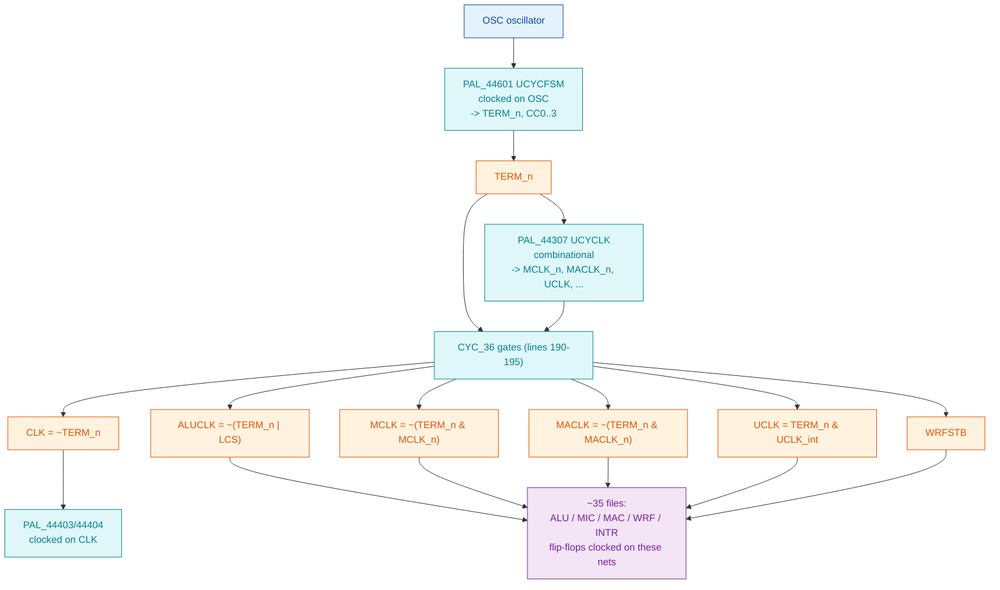

# Clock-Enable Refactor: eliminating the derived-clock nets

**Full path:** `/mnt/e/Dev/Repos/Ronny/nd-120/Verilog/docs/clock-enable-refactor.md`
**Last updated:** 2026-07-04
**Status:** SPEC FOR REVIEW - no code changed yet.

## Why

Both FPGAs fail timing (Basys3 routed **WNS approx -38.7 ns**, TNS approx
-18,000 ns; earlier synth estimate -100 ns) and the OSS/Gowin flow rejects the
TTL primitives outright. Same root cause: the CPU manufactures its clocks with
combinational gates and fans them out as **clock nets**. The 2026-07-04 Vivado
run confirmed it by force-inserting global buffers on exactly these nets:

```
Opt 31-194: Inserted BUFG ... ALUCLK_BUFG ... MCLK_BUFG ... TERM_reg_BUFG ... A239/result_BUFG
Place 30-568: A LUT '.../UCLK_INST_0' is driving clock pin of 10 registers
Place 30-568: A LUT '.../PAL_44803_URAMA/sdram_reg_i_1__0' is driving clock pin of 4 registers
```

STA cannot constrain dozens of gated/derived clock domains -> massive negative
setup AND hold slack -> logic never settles -> boot fails on hardware. This is a
**timing** fix, distinct from the latch->FF functional work (FF sim already boots
identically to latch sim). It is **board-independent** - the Tang will not fix it.

## The clock tree today (from `CPU-BOARD-3202/circuit/CYC_36.v`)

Every CPU "clock" is minted in one place - `CYC_36` - from `OSC` and `TERM_n`:



`CYC_36.v:190-195` is the literal source of the derived clocks:

```verilog
assign s_clk       = ~s_term_n;                 // CLK
assign s_aluclk    = ~(s_term_n | s_lcs);       // ALUCLK
assign s_mclk      = ~(s_term_n & s_mclk_n);    // MCLK
assign s_maclk_out = ~(s_term_n & s_maclk_n);   // MACLK
assign s_uclk_out  =  (s_term_n & s_uclk);      // UCLK
```

## Target architecture: one `sysclk` domain, derived clocks become enables

`CYC_36` becomes a **clock-enable generator**. Run the cycle FSM
(`PAL_44601`, and the `44307/44403/44404` chain) on `sysclk`, and emit
one-`sysclk`-wide **enable** signals in place of the gated clock nets:

| Old clock net | New enable | Consumers change to |
|---------------|-----------|---------------------|
| `MCLK`   | `mclk_en`   | `always @(posedge sysclk) if (mclk_en)   q<=d;` |
| `MACLK`  | `maclk_en`  | `... if (maclk_en) ...`  |
| `ALUCLK` | `aluclk_en` | `... if (aluclk_en) ...` |
| `UCLK`   | `uclk_en`   | `... if (uclk_en) ...`   |
| `CLK`    | `clk_en`    | `... if (clk_en) ...`    |
| `WRFSTB` | `wrfstb_en` | `... if (wrfstb_en) ...` |

One clock domain -> STA constrains cleanly -> timing closes (the ND-120 is slow;
one modest sysclk has ample margin). It also unblocks the OSS/Gowin flow, which
rejects the multi-edge TTL primitives.

**All new behavior is gated under `FPGA_FF_MODE`.** The Verilator latch path
(default, `USE_LATCHES=1`) stays byte-for-byte as-is; only the FF/FPGA build sees
the enable clocking. The `make compare` golden reference is therefore unchanged.

## The two idioms, and WHEN to use each (this is the load-bearing decision)

`Shared/ndlib/LATCH.v` is **already converted** and its header records the trap:

> Edge-detect was tried first and broke LCS loading, because during LCS load
> `s_aluclk_n` is held high constantly - no rising edge ever appears, so an
> edge-detect FF never fires and CSEL_Q stayed at its init value.

So there are two patterns, and picking wrong silently breaks boot:

**A. Level-capture (the LATCH pattern) - the SAFE DEFAULT.**
```verilog
always @(posedge sysclk) if (enable_level) q <= d;   // tracks d while enable high
```
Use when the "clock"/enable can be **held static** across a whole phase (the LCS
load holds ALUCLK's source static). Matches `L4.v`/`L8.v`/`LATCH.v` already in the
tree. Transparent on a 1-sysclk grain - the closest synchronous analog of the
original 74xx transparent latch.

**B. Edge-enable (one-shot) - only where a true single pulse per cycle is needed.**
```verilog
reg d1; always @(posedge sysclk) d1 <= raw;
wire en = raw & ~d1;                                 // 1-sysclk pulse on rising edge
always @(posedge sysclk) if (en) q <= d;
```
Use for genuine edge-triggered registers whose source **pulses** every cycle
(MCLK/MACLK/UCLK per bus cycle). NEVER use where the source can sit static - that
is the exact failure LATCH hit.

**Rule for the spec:** default to A (level-capture). Use B only for the per-cycle
strobes, and only after confirming the source is never held static during load.

## Per-primitive transform

Convert the **base primitives first** - the PALs and TTL parts instantiate these,
so ~7 edits fix the majority centrally. Add a `sysclk` port; treat the existing
clock port as the enable; keep the old edge semantics.

### `Shared/logisim/D_FLIPFLOP.v`  (the big one - most FFs are these)
Today (`clock` receives ALUCLK/MCLK/... as a real clock):
```verilog
assign s_clock = (InvertClockEnable == 0) ? clock : ~clock;
always @(posedge s_clock) s_currentState <= d;          // gen_sync
always @(posedge s_clock or posedge preset or posedge reset) ...  // gen_async
```
Target (FPGA_FF_MODE): sample `clock` on sysclk, edge-detect *with the original
polarity*, clock on sysclk. `InvertClockEnable==1` means the original active edge
is the **falling** edge of `clock` (posedge of `~clock`) - the enable must fire on
that same edge, else data captures a phase early/late.
```verilog
`ifdef FPGA_FF_MODE
  reg clk_d;
  always @(posedge sysclk) clk_d <= s_clock;            // s_clock already polarity-adjusted
  wire tick = s_clock & ~clk_d;                          // rising edge of s_clock
  // async preset/reset: keep them async (they are POR-class), gate d-capture on tick
  ...
`else
  ... existing latch/FF body unchanged ...
`endif
```
Open point (call out for review): async preset/reset (`ACTIVE_ASYNC==1`) - keep
truly async (POR/reset class), or also synchronize to sysclk? Leaning: keep async
(they mirror the hardware master-clear and only fire at reset).

### `Shared/ndlib/LATCH.v`, `L4.v`, `L8.v`  - ALREADY DONE (pattern A). Use as reference.

### `Shared/ndlib/R81.v`, `R41P.v`, `R81P.v`, `SCAN_FF.v`
Same as D_FLIPFLOP: add `sysclk`, old clock -> enable. These are register banks;
most are per-cycle strobed (pattern B) but VERIFY each source against the
static-hold rule before choosing B over A.

### `Shared/logisim/T_FLIPFLOP.v`, `J_K_FLIPFLOP.v`
Multi-edge (clock + async pre/clr) - the exact ones yosys rejects. Same transform;
these gate the OSS/Gowin flow, so they must be done for Tang regardless.

## CYC_36 enable-generator

1. **Reduce OSC to a sysclk tick.** `PAL_44601` clocks on `OSC` today. Either (a)
   drive the FSM on sysclk with an `osc_tick` enable (edge-detect OSC on sysclk),
   or (b) if `OSC` is already the same rate as/derived from sysclk in the FPGA
   branch of `ND120_TOP.v`, make it a straight sysclk tick. Decide by reading how
   `ND120_TOP.v` drives `OSC` in the FPGA branch (MMCM output today).
2. **Run the 44601/44307/44403/44404 chain on sysclk** (their Q-registers become
   sysclk + osc_tick enable). `PAL_44601` currently `always @(posedge CK)` with
   `CK=OSC`; `PAL_44403/44404` on `CLK=~TERM_n`.
3. **Emit the enables.** From the same combinational equations (lines 190-195),
   produce a 1-sysclk pulse per net:
   - `clk_en`    from `~s_term_n` rising
   - `aluclk_en` from `~(s_term_n | s_lcs)` rising  (BUT: `s_lcs` static-high during
     LCS load -> this is the ALUCLK/LCS case that broke edge-detect. Use pattern A
     for the ALUCLK consumers, i.e. level-capture while `~(s_term_n|s_lcs)` high.)
   - `mclk_en` / `maclk_en` from the `MCLK`/`MACLK` expressions rising (pattern B,
     per-cycle strobes)
   - `uclk_en`, `wrfstb_en` likewise
4. Keep the current combinational outputs (`ALUCLK`, `MCLK`, ...) too, under the
   non-FPGA path, so the latch sim is untouched.

## Sequencing (guardrailed by `make compare` after EVERY step)

`make compare` (`sim/`) builds latch + FF, runs both, diffs 16 tracked signals ->
must print IDENTICAL (bar the known BDRY cycle-0 transient). Any step that
diverges is caught in seconds, in sim, before the FPGA.

1. **CYC_36 enable-generator + the ~7 base primitives** (one increment).
   `make compare` -> IDENTICAL.
2. **PAL Q-registers** (44601 on osc_tick; 44307/44403/44404 chain). `make compare`.
3. **Any remaining derived-clock always-blocks** flagged by grep
   (`CGA_ALU_ARG`, `CGA_WRF_RBLOCK_DR16`, `BIF_DPATH_PPNLBD_14`, the PAL set, TTL
   parts, `SC2661_UART`). `make compare` after each cluster.
4. **Re-synth Basys3** (`fpga/basys3/vivado_build.ps1`) -> confirm WNS goes
   **positive** and no `BUFG inserted on <derived>` / `LUT driving clock pin`
   warnings remain. That is the acceptance test for the whole refactor.
5. Then Tang: the same conversion also clears the yosys multi-edge rejections.

## Risks / open questions (resolve during review)

- [ ] `OSC` in the FPGA branch of `ND120_TOP.v`: what actually drives it? Decides
      whether the FSM needs an `osc_tick` enable or `OSC==sysclk`.
- [ ] `InvertClockEnable` polarity per primitive instance - the active edge must be
      preserved exactly (falling `clock` == rising `~clock`).
- [ ] Async preset/reset (`D_FLIPFLOP ACTIVE_ASYNC==1`): keep async vs synchronize.
- [ ] Which R81/R41P/SCAN_FF sources are static-hold (need pattern A) vs per-cycle
      strobe (pattern B). Audit each before choosing.
- [ ] `WRFSTB` timing - it is a write strobe, confirm level vs edge.

## Files touched (spec target - none edited yet)

- `Shared/logisim/D_FLIPFLOP.v`, `T_FLIPFLOP.v`, `J_K_FLIPFLOP.v`
- `Shared/ndlib/R81.v`, `R41P.v`, `R81P.v`, `SCAN_FF.v`  (LATCH/L4/L8 already done)
- `CPU-BOARD-3202/circuit/CYC_36.v`  (enable-generator)
- `PAL/PAL_44601B.v`, `PAL_44307C.v`, `PAL_44403C.v`, `PAL_44404C.v`
- remaining derived-clock modules per `fpga-debug-methodology.md` 3.2 work list
- `Verilog/ND120_TOP.v`  (thread `sysclk`/`osc_tick` if needed)

## References
- `fpga-debug-methodology.md` 3.2 - root cause + 35-file work list.
- `sim/FPGA_REFACTORING_GUIDE.md` - the async-clock -> synchronous pattern.
- `Shared/ndlib/LATCH.v` - the already-converted reference (pattern A + the LCS trap).
- `boot-golden-spec.md` - the boot phases `make compare` must still hit.
