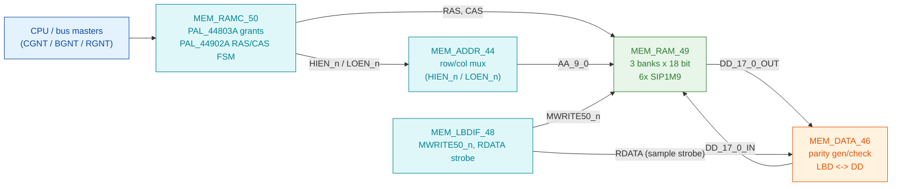

# ND-120 main memory: how MEM_RAM_49 and the DRAM protocol work, and how to map it per board

**Full path:** `/mnt/e/Dev/Repos/Ronny/nd-120/Verilog/docs/nd120-dram-memory.md`
**Date:** 8-JUL-2026. Measured numbers come from a Verilator run with `-DDBG_MEM`
(25,008 memory accesses captured, see [Measured protocol](#measured-protocol-ground-truth-from-simulation)).

---

## 1. Architecture and hierarchy

The ND-120's main memory is the original machine's **1M x 9 DRAM SIP modules**
(THM91020/THM91070), six of them, driven by a PAL-based DRAM controller. In
Verilog:

```
ND3202D                          CPU board top (CPU-BOARD-3202/circuit/ND3202D.v)
 └─ MEM_43                       memory subsystem top (sheet 43)
     ├─ MEM_ADDR_44              address mux: row/column onto AA_9_0 (HIEN_n/LOEN_n)
     ├─ MEM_ADEC_45              address decode, bank select, RLRQ generation
     ├─ MEM_DATA_46              data path, parity generate/check (Am29833A), LBD<->DD
     ├─ MEM_ERROR_47             error handling (RDATA25)
     ├─ MEM_LBDIF_48             local-bus interface: grants, MWRITE50_n, RDATA strobe
     ├─ MEM_RAM_49               THE RAM SHEET - 3 banks x 2 chips (this is the
     │    └─ 6x SIP1M9           swap point for per-board memory backends)
     └─ MEM_RAMC_50              RAM control: PAL_44803A (arbitration/grants)
                                 + PAL_44902A (RAS/CAS state machine)
```



**Organization:** 3 banks (`BANK0/1/2`), each bank = 2 SIP1M9 chips = 18 bits
per word (16 data + 2 parity). Per bank up to 1M words. `MEM_RAM_49` ORs the
three banks' `DD` outputs together; unselected chips drive 0 (the FPGA-safe
"tri-state" convention used throughout this repo).

**Interface of MEM_RAM_49** (the contract any board backend must honour):

| Signal | Dir | Meaning |
|--------|-----|---------|
| `AA_9_0` | in | Multiplexed address: **row** during RAS fall, **column** while CAS low |
| `BANK0/1/2` | in | Bank select (already decoded, one-hot) |
| `RAS`, `CAS` | in | Active-high strobes from PAL_44902A (chips see them inverted/bank-gated) |
| `MWRITE50_n` | in | Write when low, stable across the whole access |
| `DD_17_0_IN` | in | Write data (16 data + 2 parity) |
| `DD_17_0_OUT` | out | Read data; must be 0 when not selected/reading (banks are OR-ed) |
| `CORR_n` | out | Parity of read data (chips' PRD outputs ANDed) |

---

## 2. Where the clocks come from

There is **one clock**. `OSC` at the memory subsystem is the same net as
`sysclk`/`clk_cpu` from `ND120_TOP.v` (`clk1 = clk_cpu`, "CLOCK_1/CLOCK_2
(OSC/bus) run at CPU speed"). Both control PALs are **registered PALs clocked
on OSC** (PAL16R8): every RAS/CAS/HIEN/LOEN edge happens on an OSC rising
edge. So although the interface *looks* like an async DRAM protocol, in this
implementation it is a **fully synchronous, single-clock state machine** -
which is exactly what makes it easy to retarget.

Current frequencies:

| Build | OSC = sysclk | Note |
|-------|--------------|------|
| Verilator sim | `BOARD_CLK_FREQ` (100 MHz default) | zero-delay; ratios are what matter |
| Basys3 | ~16.67 MHz (`clk_cpu` from MMCM) | ~39.06 MHz is the stated target after timing closure |
| Tang Nano 20K (planned) | 27 MHz from rPLL initially | raise later (see section 7) |

## 3. How RAS and CAS are generated

`PAL_44803A` (URAMA) arbitrates requests into grants: `CGNT_n` (CPU),
`BGNT_n` (bus), `RGNT_n` (refresh, from `RLRQ_n`). `PAL_44902A` (URAMC) is a
4-bit one-sequence state machine `Q = {QD,QC,QB,QA}` started by a grant; its
registered outputs sequence one access:

- `RAS` active during internal states 1-6
- `CAS` active during states 4-8 (and a special "CAS ON REFRESH = 1,2,3,4,5"
  path when the grant is a **refresh** grant `RGNT` - i.e. CAS-before-RAS,
  the classic DRAM refresh cycle)
- `HIEN_n` (row address enable, states 0,1,2,8) / `LOEN_n` (column address
  enable, states 3-6) drive the row/column mux in `MEM_ADDR_44`
- The PAL comment "NO WAIT STATE ON CPU TO MEMORY WRITE" is literal: **the
  sequence has fixed length, there is no way for the memory to stall it.**
  Any replacement backend must meet the fixed deadline.

The `RDATA` sample strobe (when the read data is consumed into the parity
checker/latches of `MEM_DATA_46`) is produced by a PAL in `MEM_LBDIF_48` from
the grant/enable phases.

## 4. Measured protocol (ground truth from simulation)

Instrumentation is built into `Shared/support/SIP1M9.v` (`-DDBG_MEM`). Build:
`cd Verilog/sim && make test_nd120 SIM_DEFINES="-DVERILATOR_SIM -DDBG_MEM"`.
From 25,008 captured accesses, **every single access has the identical
signature** (cycle numbers are OSC cycles, N = RAS falling edge):

| OSC cycle | RAS_n | CAS_n | AA carries | Notes |
|-----------|-------|-------|------------|-------|
| N | 0 | 1 | **row** | row must be captured at this edge; `W_n` already valid |
| N+1 | 0 | 1 | **column** | AA has switched to column |
| N+2 | 0 | 0 | column | CAS falls - access begins; write data `DD_IN` valid |
| N+3 | 0 | 0 | column | both-low window |
| N+4 | 0 | 0 | column | both-low window (last) |
| N+5 | 1 | 0 | (next) | RAS released, CAS tail |
| N+6 | 1 | 1 | - | idle |

Statistics: CAS falls exactly `RAS_fall + 2` in 25,008 of 25,008 accesses.
RAS-to-RAS spacing: **minimum 11 cycles** (1,280 seen), mode 17 (18,004),
then 24/33/... No back-to-back accesses closer than 11 OSC cycles exist.
~10% of accesses are writes. `W_n` is stable from N through N+5.

**Read-data deadline:** the proven reference is the Basys3 BRAM path in
`SIP1M9.v` (`ramSize=3`): it performs a registered read on the first both-low
edge, so data is on `DD_OUT` from the **start of N+3**, registered and held
while CAS stays low; the `RDATA` strobe samples it "late in the cycle while
CAS is still low". A backend that has data valid and held **by the start of
N+4 at the latest** is on the safe side of the proven behaviour.

**Refresh:** the design has a complete refresh chain - DGA `XRFN` ->
`REFRQ_n` -> `RLRQ_n` -> `RGNT_n` -> PAL "CAS ON REFRESH" states - but **zero
refresh cycles were observed in a ~2.8 ms sim window** (an implemented XRFN
divider would have produced ~180). The sim DRAM model doesn't need refresh, so
nothing in the sim exercises it. Conclusion for real dynamic memory backends:
**do not rely on the board logic to schedule refresh; generate it yourself.**

## 5. The aligned backend family (implemented 8-JUL-2026)

All main-memory backends share the **sheet-49 interface** and are selected in
`MEM_43.v` by one define chain:

| Define | Module | Backend |
|--------|--------|---------|
| `MAIN_RAM_SDRAM` | `fpga/tang-nano-20k/sdram-bridge/MEM_RAM_49_SDRAM.v` | Tang Nano 20K embedded 8 MB SDRAM (2 banks = 4 MB) |
| `MAIN_RAM_BLOCKRAM` | `CPU-BOARD-3202/circuit/MEM_RAM_49_BLOCKRAM.v` | One clean synchronous BRAM, parameterized size (Basys3 default 3 banks x 4K words; CMOD A7 etc. raise `BANK_ADDR_BITS`) |
| `VERILATOR_SIM` (else) | `CPU-BOARD-3202/circuit/MEM_RAM_49_SIM.v` | Zero-delay DRAM model, 3 banks x 1M = 6 MB; C++ preload via `RAM.b0_lo/b0_lo_p/b0_hi/b0_hi_p` |
| (none) | `CPU-BOARD-3202/circuit/MEM_RAM_49.v` | Original six SIP1M9 chips - historical reference, FPGA default until a board opts in |

**Hardware-truth rules baked into the FPGA backends** (from the 8-JUL Tang
write debugging - three builds of evidence):

1. Row: captured exactly once, at the RAS **rising edge** (never a level).
2. Address registers upstream (MEM_ADDR_44): **edge-capture** on the grant
   (AM29C821 `USE_SYSCLK=2`), never a level enable - LBD is address-then-data
   multiplexed.
3. Write data: the DD bus is driven BEFORE CAS and **released around
   CAS-fall** on silicon (mid-window samples read a dying/dead bus, even
   though zero-delay sim shows it valid forever). Capture on sysclk every
   edge until CAS is seen high - the final capture holds the settled
   pre-CAS value.
4. Write executed **once**, at the first RAS&CAS window edge (last-write-wins
   re-writing captures the dead bus).
5. Read: registered during the window, held while CAS is active, output and
   parity gated to 0/1 when unselected (banks OR together).

Pre-synth testbenches for all of this: `CPU-BOARD-3202/circuit/sim/`
(`make test-memaddr test-memchain test-memchain-blockram test-memchain-sim`)
plus the SDRAM bridge's own tb (`fpga/tang-nano-20k/sdram-bridge/sim/`).

### Tang Nano 20K: embedded 8 MB SDRAM

See section 6.

## 6. Mapping the protocol onto the Tang Nano 20K SDRAM

The controller (validated on hardware in
[`../fpga/tang-nano-20k/sdram-test/`](../fpga/tang-nano-20k/sdram-test/README.md))
is the nand2mario byte-based one: `rd`/`wr` pulse -> 5-cycle operation, read
data 4 cycles after `rd`, CL=2, auto-precharge, max 66.7 MHz, plus an explicit
`refresh` command (one per 15 us needed).

### Structure: replace MEM_RAM_49 per board

Rather than growing more `ifdef` branches inside `SIP1M9`, swap the **whole
sheet-49 body** per target (this also cleans up the existing split):

```
MEM_RAM_49.v            thin wrapper: selects an implementation by define
 ├─ (default)           6x SIP1M9 as today (Verilator DRAM model / Basys3 BRAM)
 └─ MAIN_RAM_SDRAM      MEM_RAM_49_SDRAM.v - protocol bridge + nand2mario sdram.v
                        (enabled only by the Tang build; Verilator and Basys3
                        builds are untouched)
```

### The bridge (MEM_RAM_49_SDRAM)

Clocking: run the SDRAM controller on a **2x OSC clock** (54 MHz for a 27 MHz
OSC) from the same rPLL, plus the 180-degree `clkoutp` for the SDRAM chip.
Same-PLL integer-ratio clocks: the crossing is a fixed phase relationship,
not a true CDC.

Per the measured protocol (OSC cycles, 2x-clock cycles in parentheses):

1. **N:** RAS fall - capture row from `AA`, `W_n`, bank.
2. **N+1:** capture column from `AA` (it is already there - one cycle before
   CAS falls, which buys an extra 2 fast cycles of latency budget).
3. **N+1/N+2:** issue `rd` or `wr` to the controller (fast clock edge 2N+2..4).
   Address = `{bank[1:0], row[9:0], col[9:0]}` word index. For a write, `DD_IN`
   is valid from N+2.
4. Read: `data_ready` 4 fast cycles later = **by OSC N+4**; register into an
   18-bit holding register, drive `DD_17_0_OUT` while CAS is low (same
   register-and-hold shape as the proven Basys3 BRAM path). Deadline met.
5. Write: controller busy 5 fast cycles = 2.5 OSC; the minimum 11-cycle
   RAS-to-RAS spacing gives enormous headroom.

**Refresh (we own it):** 15 us timer on the fast clock. Issue `refresh`
**immediately after an access completes** (N+5): it finishes within 2.5 OSC
cycles, guaranteed before the earliest possible next access (N+11). Plus an
idle watchdog: if no access has happened for >1 us, refresh anytime; the
worst case - a refresh started on the same edge RAS falls - delays the read
issue by ~2.5 OSC and the data to ~N+5, which is why post-access refresh is
the primary mechanism and the watchdog only covers an idle CPU.

### Word width: 18 bits into a 32-bit SDRAM

The SDRAM is 2M x 32. The clean mapping is **one 18-bit ND word per 32-bit
SDRAM word** (needs the controller's 32-bit port instead of the byte port - a
small modification; `dout32` already exists, writes need a 4-lane DQM=0000
variant). Capacity: 2M words = **2 banks of 1M words = 4 MB** - BANK2 simply
reports absent, the ND-120's boot-time size probing handles missing banks
(that is how the machine was sold with less than max memory).

Alternative if 3 full banks (6 MB) are ever needed: store only the 16 data
bits (3M x 16 fits in 6 MB of the 8 MB) and recompute the 2 parity bits on
read. **Rejected for now**: the self-test deliberately writes bad parity to
test the error path; recomputed parity would break that.

## 7. Frequencies and how to adjust per board

Two independent knobs, both already established in this repo:

- **`BOARD_CLK_FREQ`** - every derived count (UART baud divisors, DGA RTC
  tick, refresh interval) must be computed from it (this is the rule from the
  OPCOM console speed fix). The bridge's 15 us refresh count is
  `2*BOARD_CLK_FREQ/1_000_000*15` on the fast clock.
- **The PLL** per board sets OSC and the memory fast clock:

| Board | OSC (CPU/bus/memory FSM) | Memory backend clock | Limits |
|-------|--------------------------|----------------------|--------|
| Verilator | `BOARD_CLK_FREQ` (any) | same (zero-delay model) | none |
| Basys3 | 16.67 MHz now, ~39.06 MHz target | = OSC (BRAM) | FPGA timing closure |
| Tang Nano 20K | 27 MHz (rPLL) first | 54 MHz (= 2x OSC, rPLL `clkoutp` for chip) | controller params good to 66.7 MHz; LiteX proves the die at 48 MHz CL-2 |
| Other SDRAM boards | pick f | 2x f, 180-degree chip clock | keep 2x ratio and the deadline math of section 6 |

Raising the Tang above 27 MHz (TODO G4): 2x clock hits the 66.7 MHz
controller ceiling at OSC = 33 MHz. Beyond that, either retune the
controller's CAS/T_xx parameters for >66.7 MHz operation (the die itself is a
166 MHz part) or drop to a 1x-clock bridge, which no longer meets the N+4
deadline - so the realistic ceiling for this bridge design is **OSC ~= 33 MHz,
SDRAM ~= 66 MHz** until the controller timing parameters are revisited.

## 8. References

- `CPU-BOARD-3202/circuit/MEM_RAM_49.v`, `MEM_RAMC_50.v`, `MEM_ADDR_44.v`,
  `MEM_LBDIF_48.v`, `MEM_DATA_46.v` - the memory subsystem sheets
- `PAL/PAL_44902A.v` (RAS/CAS state machine), `PAL/PAL_44803A.v` (grants)
- `Shared/support/SIP1M9.v` - both existing backends + `DBG_MEM` instrumentation
- [`../fpga/tang-nano-20k/sdram-test/`](../fpga/tang-nano-20k/sdram-test/README.md) -
  hardware-validated SDRAM controller + board bring-up findings
- `Verilog/TODO.md` - "Tang Nano 20K bring-up" section tracks this work
