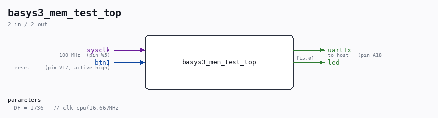

# basys3_mem_test_top

Source: `/mnt/e/Dev/Repos/Ronny/nd-120/Verilog/fpga/basys3/mem-test/basys3_mem_test_top.v`

> Generated by `Verilog/tests/module_doc.py` from the `//!`
> comments in the source. Do not edit by hand - edit the RTL comments and regenerate.

## Description

Basys3 standalone memory test for the ND-120 BRAM path
Isolates MEM_RAM_49 (-> SIP1M9 sync BRAM, ramSize=3) from the whole CPU.
Drives the exact DRAM RAS/CAS/AA protocol the real controller uses
(captured via DBG_MEM: row valid at RAS-fall, AA -> col while CAS still
high, both strobes low a few cycles, read data captured while RAS is
deasserted and CAS still low), then writes+reads+verifies a handful of
addresses and reports each over UART (9600 8N1) using msg_printer.
If this PASSES on the board, the BRAM path is fine and the memory bug is
in the CPU/MAC integration. If it FAILS, the fault is here where we can
iterate directly.

## Parameters

| Parameter | Default |
|---|---|
| `DF` | `1736   // clk_cpu(16.667MHz` |

## Ports

| Direction | Width | Name | Description |
|---|---|---|---|
| input | `1` | `sysclk` | 100 MHz  (pin W5) |
| input | `1` | `btn1` | reset     (pin V17, active high) |
| output | `1` | `uartTx` | to host   (pin A18) |
| output | `[15:0]` | `led` |  |
