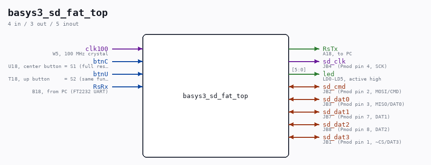

# basys3_sd_fat_top

Source: `/mnt/e/Dev/Repos/Ronny/nd-120/Verilog/fpga/basys3/sd-fat-test/basys3_sd_fat_top.v`

> Generated by `Verilog/tests/module_doc.py` from the `//!`
> comments in the source. Do not edit by hand - edit the RTL comments and regenerate.

## Description

Basys3 wrapper for the SD-FAT test (sd_fat_test_top)
The test design itself is board-independent (single clock domain, all
SD/UART speeds derived from CLK_FREQ by enable dividers). This wrapper
only provides:
- a 27.027 MHz clock from the Basys3 100 MHz crystal (MMCM, x10/37),
so every divider/watchdog parameter stays identical to the
hardware-proven Tang Nano 20K build (CLK_FREQ passed exactly),
- button mapping: btnC (center) = S1 full reset, btnU (up) = S2;
reset is also held while the MMCM is unlocked,
- LED polarity: the test drives active-LOW (Tang convention),
Basys3 LEDs are active-HIGH -> inverted here (LD0-LD5),
- UART to the FT2232 (RsRx/RsTx), 9600 8N1,
- SD signals straight through to Pmod JB (top-right connector),
Digilent Pmod MicroSD pinout (see basys3_sd_fat.xdc).
Build: vivado -mode batch -source build.tcl   (see README.md)
Last reviewed: 13-JUL-2026
Ronny Hansen

## Ports

| Direction | Width | Name | Description |
|---|---|---|---|
| input | `1` | `clk100` | W5, 100 MHz crystal |
| input | `1` | `btnC` | U18, center button = S1 (full reset), active high |
| input | `1` | `btnU` | T18, up button     = S2 (same function), active high |
| input | `1` | `RsRx` | B18, from PC (FT2232 UART) |
| output | `1` | `RsTx` | A18, to PC |
| output | `1` | `sd_clk` | JB4  (Pmod pin 4, SCK) |
| inout | `1` | `sd_cmd` | JB2  (Pmod pin 2, MOSI/CMD) |
| inout | `1` | `sd_dat0` | JB3  (Pmod pin 3, MISO/DAT0) |
| inout | `1` | `sd_dat1` | JB7  (Pmod pin 7, DAT1) |
| inout | `1` | `sd_dat2` | JB8  (Pmod pin 8, DAT2) |
| inout | `1` | `sd_dat3` | JB1  (Pmod pin 1, ~CS/DAT3) |
| output | `[5:0]` | `led` | LD0-LD5, active high |
