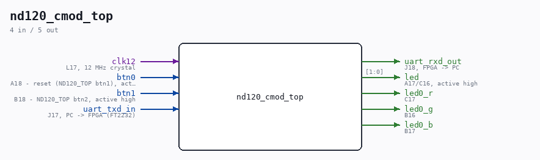

# nd120_cmod_top

Source: `/mnt/e/Dev/Repos/Ronny/nd-120/Verilog/fpga/cmod-a7-35t/nd120_cmod_top.v`

> Generated by `Verilog/tests/module_doc.py` from the `//!`
> comments in the source. Do not edit by hand - edit the RTL comments and regenerate.

## Description

Cmod A7-35T wrapper for the ND-120 CPU (ND120_TOP, BRAM main memory)
First-version bring-up build: same shape as the Basys3 build
(FPGA_FF_MODE + MAIN_RAM_BLOCKRAM + runtime WCS load from the PROM
images), but clocked at 27 MHz - the Tang Nano 20K's full CPU speed -
via the TARGET_CMOD_A7 MMCM branch in ND120_TOP.v (12 MHz x 63 / 28 =
27.000 MHz exactly; BOARD_CLK_FREQ=27000000 keeps every derived count
honest).
The wrapper only adapts the board I/O: the Cmod has 2 buttons, 2 LEDs
+ 1 RGB LED, no switches, no 7-segment display. ND120_TOP's seg/an
outputs are left unconnected and its 16-bit LED bus is condensed to
what the board has.
Build: vivado -mode batch -source build.tcl   (see README.md)
Last reviewed: 13-JUL-2026
Ronny Hansen

## Ports

| Direction | Width | Name | Description |
|---|---|---|---|
| input | `1` | `clk12` | L17, 12 MHz crystal |
| input | `1` | `btn0` | A18 - reset (ND120_TOP btn1), active high |
| input | `1` | `btn1` | B18 - ND120_TOP btn2, active high |
| input | `1` | `uart_txd_in` | J17, PC -> FPGA (FT2232) |
| output | `1` | `uart_rxd_out` | J18, FPGA -> PC |
| output | `[1:0]` | `led` | A17/C16, active high |
| output | `1` | `led0_r` | C17 |
| output | `1` | `led0_g` | B16 |
| output | `1` | `led0_b` | B17 |
