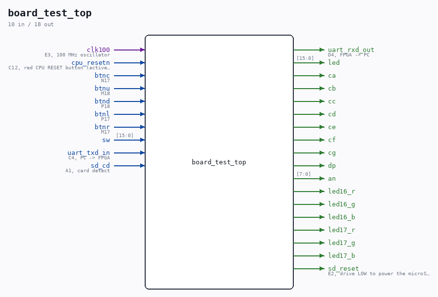

# board_test_top

Source: `/mnt/e/Dev/Repos/Ronny/nd-120/Verilog/fpga/nexys4ddr/board-test/board_test_top.v`

> Generated by `Verilog/tests/module_doc.py` from the `//!`
> comments in the source. Do not edit by hand - edit the RTL comments and regenerate.

## Description

Nexys 4 DDR board check - proves the parts the ND-120 build depends on
This is a BRING-UP test, not an ND-120 build. It exercises exactly the
board resources fpga/nexys4ddr/build.tcl relies on, so a failure here
is a board or toolchain problem, never a CPU problem:
- the 100 MHz oscillator and the MMCM that makes clk_cpu (the same
VCO 1000 MHz / 60 = 16.667 MHz the ND-120 build uses by default)
- all 16 slide switches -> all 16 LEDs
- all 8 seven-segment digits and all 7 segments + decimal point
- the five buttons and the active-low CPU RESET button
- the USB-UART at 9600 8N1, both directions - the ND-120 console
- the microSD slot power gate and card-detect switch
- the two RGB LEDs (status)
What it does NOT test: DDR2, VGA, Ethernet, accelerometer, microphone,
audio, USB-HID. The factory demo in the QSPI flash covers those - see
README.md, and run that FIRST.
Last reviewed: 20-AUG-2026
Ronny Hansen

## Ports

| Direction | Width | Name | Description |
|---|---|---|---|
| input | `1` | `clk100` | E3, 100 MHz oscillator |
| input | `1` | `cpu_resetn` | C12, red CPU RESET button (active low) |
| input | `1` | `btnc` | N17 |
| input | `1` | `btnu` | M18 |
| input | `1` | `btnd` | P18 |
| input | `1` | `btnl` | P17 |
| input | `1` | `btnr` | M17 |
| input | `[15:0]` | `sw` |  |
| input | `1` | `uart_txd_in` | C4, PC -> FPGA |
| output | `1` | `uart_rxd_out` | D4, FPGA -> PC |
| output | `[15:0]` | `led` |  |
| output | `1` | `ca` |  |
| output | `1` | `cb` |  |
| output | `1` | `cc` |  |
| output | `1` | `cd` |  |
| output | `1` | `ce` |  |
| output | `1` | `cf` |  |
| output | `1` | `cg` |  |
| output | `1` | `dp` |  |
| output | `[7:0]` | `an` |  |
| output | `1` | `led16_r` |  |
| output | `1` | `led16_g` |  |
| output | `1` | `led16_b` |  |
| output | `1` | `led17_r` |  |
| output | `1` | `led17_g` |  |
| output | `1` | `led17_b` |  |
| output | `1` | `sd_reset` | E2, drive LOW to power the microSD slot |
| input | `1` | `sd_cd` | A1, card detect |
