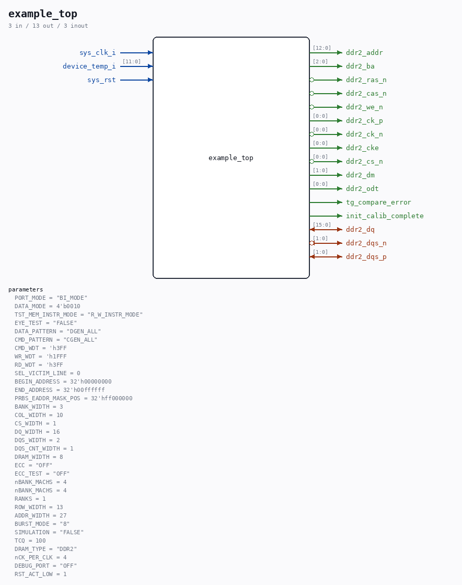

# example_top

Source: `/mnt/e/Dev/Repos/Ronny/nd-120/Verilog/fpga/nexys4ddr/ddr2-test/ip/ddr/ddr/example_design/rtl/example_top.v`

> Generated by `Verilog/tests/module_doc.py` from the `//!`
> comments in the source. Do not edit by hand - edit the RTL comments and regenerate.

## Parameters

| Parameter | Default |
|---|---|
| `PORT_MODE` | `"BI_MODE"` |
| `DATA_MODE` | `4'b0010` |
| `TST_MEM_INSTR_MODE` | `"R_W_INSTR_MODE"` |
| `EYE_TEST` | `"FALSE"` |
| `DATA_PATTERN` | `"DGEN_ALL"` |
| `CMD_PATTERN` | `"CGEN_ALL"` |
| `CMD_WDT` | `'h3FF` |
| `WR_WDT` | `'h1FFF` |
| `RD_WDT` | `'h3FF` |
| `SEL_VICTIM_LINE` | `0` |
| `BEGIN_ADDRESS` | `32'h00000000` |
| `END_ADDRESS` | `32'h00ffffff` |
| `PRBS_EADDR_MASK_POS` | `32'hff000000` |
| `BANK_WIDTH` | `3` |
| `COL_WIDTH` | `10` |
| `CS_WIDTH` | `1` |
| `DQ_WIDTH` | `16` |
| `DQS_WIDTH` | `2` |
| `DQS_CNT_WIDTH` | `1` |
| `DRAM_WIDTH` | `8` |
| `ECC` | `"OFF"` |
| `ECC_TEST` | `"OFF"` |
| `nBANK_MACHS` | `4` |
| `nBANK_MACHS` | `4` |
| `RANKS` | `1` |
| `ROW_WIDTH` | `13` |
| `ADDR_WIDTH` | `27` |
| `BURST_MODE` | `"8"` |
| `SIMULATION` | `"FALSE"` |
| `TCQ` | `100` |
| `DRAM_TYPE` | `"DDR2"` |
| `nCK_PER_CLK` | `4` |
| `DEBUG_PORT` | `"OFF"` |
| `RST_ACT_LOW` | `1` |

## Ports

| Direction | Width | Name | Description |
|---|---|---|---|
| inout | `[15:0]` | `ddr2_dq` |  |
| inout | `[1:0]` | `ddr2_dqs_n` *(active low)* |  |
| inout | `[1:0]` | `ddr2_dqs_p` |  |
| output | `[12:0]` | `ddr2_addr` |  |
| output | `[2:0]` | `ddr2_ba` |  |
| output | `1` | `ddr2_ras_n` *(active low)* |  |
| output | `1` | `ddr2_cas_n` *(active low)* |  |
| output | `1` | `ddr2_we_n` *(active low)* |  |
| output | `[0:0]` | `ddr2_ck_p` |  |
| output | `[0:0]` | `ddr2_ck_n` *(active low)* |  |
| output | `[0:0]` | `ddr2_cke` |  |
| output | `[0:0]` | `ddr2_cs_n` *(active low)* |  |
| output | `[1:0]` | `ddr2_dm` |  |
| output | `[0:0]` | `ddr2_odt` |  |
| input | `1` | `sys_clk_i` |  |
| output | `1` | `tg_compare_error` |  |
| output | `1` | `init_calib_complete` |  |
| input | `[11:0]` | `device_temp_i` |  |
| input | `1` | `sys_rst` |  |
