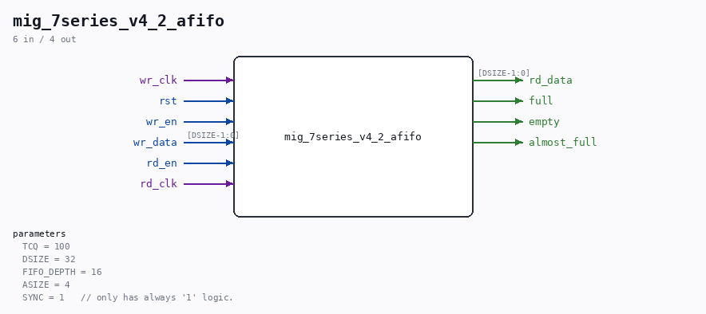

# mig_7series_v4_2_afifo

Source: `/mnt/e/Dev/Repos/Ronny/nd-120/Verilog/fpga/nexys4ddr/ddr2-test/ip/ddr/ddr/example_design/rtl/traffic_gen/mig_7series_v4_2_afifo.v`

> Generated by `Verilog/tests/module_doc.py` from the `//!`
> comments in the source. Do not edit by hand - edit the RTL comments and regenerate.

## Parameters

| Parameter | Default |
|---|---|
| `TCQ` | `100` |
| `DSIZE` | `32` |
| `FIFO_DEPTH` | `16` |
| `ASIZE` | `4` |
| `SYNC` | `1   // only has always '1' logic.` |

## Ports

| Direction | Width | Name | Description |
|---|---|---|---|
| input | `1` | `wr_clk` |  |
| input | `1` | `rst` |  |
| input | `1` | `wr_en` |  |
| input | `[DSIZE-1:0]` | `wr_data` |  |
| input | `1` | `rd_en` |  |
| input | `1` | `rd_clk` |  |
| output | `[DSIZE-1:0]` | `rd_data` |  |
| output | `1` | `full` |  |
| output | `1` | `empty` |  |
| output | `1` | `almost_full` |  |
