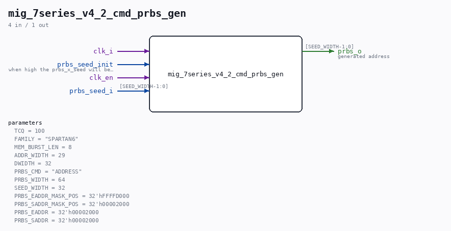

# mig_7series_v4_2_cmd_prbs_gen

Source: `/mnt/e/Dev/Repos/Ronny/nd-120/Verilog/fpga/nexys4ddr/ddr2-test/ip/ddr/ddr/example_design/rtl/traffic_gen/mig_7series_v4_2_cmd_prbs_gen.v`

> Generated by `Verilog/tests/module_doc.py` from the `//!`
> comments in the source. Do not edit by hand - edit the RTL comments and regenerate.

## Parameters

| Parameter | Default |
|---|---|
| `TCQ` | `100` |
| `FAMILY` | `"SPARTAN6"` |
| `MEM_BURST_LEN` | `8` |
| `ADDR_WIDTH` | `29` |
| `DWIDTH` | `32` |
| `PRBS_CMD` | `"ADDRESS"` |
| `PRBS_WIDTH` | `64` |
| `SEED_WIDTH` | `32` |
| `PRBS_EADDR_MASK_POS` | `32'hFFFFD000` |
| `PRBS_SADDR_MASK_POS` | `32'h00002000` |
| `PRBS_EADDR` | `32'h00002000` |
| `PRBS_SADDR` | `32'h00002000` |

## Ports

| Direction | Width | Name | Description |
|---|---|---|---|
| input | `1` | `clk_i` |  |
| input | `1` | `prbs_seed_init` | when high the prbs_x_seed will be loaded |
| input | `1` | `clk_en` |  |
| input | `[SEED_WIDTH-1:0]` | `prbs_seed_i` |  |
| output | `[SEED_WIDTH-1:0]` | `prbs_o` | generated address |
